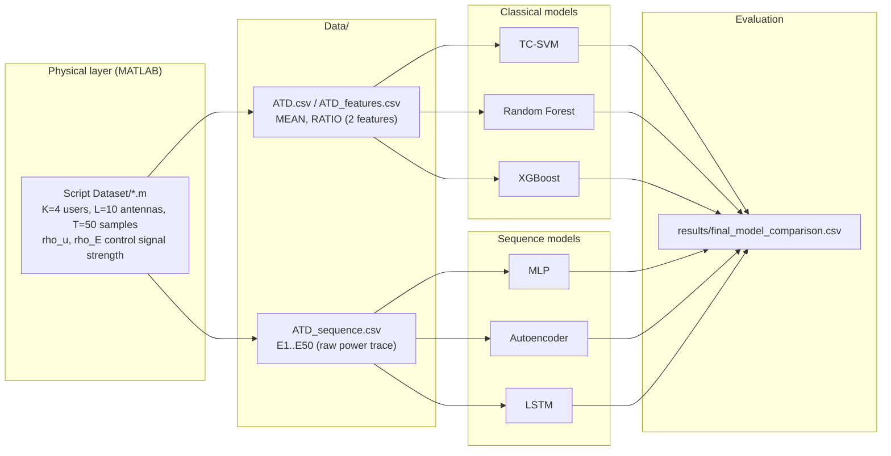

# Active Eavesdropping Detection (ATD)

Machine learning pipeline for detecting active eavesdropping (pilot
contamination) attacks in a multi-user wireless uplink, following the
physical-layer framework of Hoang et al. Six models are trained and
compared on simulated channel data: TC-SVM, Random Forest, XGBoost, MLP,
an Autoencoder, and an LSTM.

## Result

| Model | Accuracy | Precision | Recall | F1 | AUC |
|---|---|---|---|---|---|
| **LSTM** | **0.9925** | 0.9950 | 0.9900 | 0.9925 | 0.9996 |
| MLP | 0.9875 | 0.9899 | 0.9850 | 0.9875 | 0.9992 |
| Autoencoder | 0.9700 | 0.9498 | 0.9925 | 0.9707 | 0.9981 |
| XGBoost | 0.9423 | 0.9499 | 0.9338 | 0.9418 | 0.9799 |
| TC-SVM | 0.9421 | 0.9528 | 0.9303 | 0.9414 | 0.9789 |
| Random Forest | 0.9418 | 0.9503 | 0.9323 | 0.9412 | 0.9804 |

Full comparison: [`results/final_model_comparison.csv`](results/final_model_comparison.csv).
See [docs/methodology.md](docs/methodology.md) for the full write-up, including
statistical significance testing, an SNR-difficulty sweep, and several
robustness checks beyond this baseline table.

## The physical model

A base station with `L=10` antennas serves `K=4` legitimate users, each
identified by pilot signals. An eavesdropper attempts pilot contamination:
it transmits on the same pilot as a target user, spoofing its identity so
the base station can't tell the two apart from the received signal alone.
The detector's job is to look at the received power over `T=50` time
samples and decide whether an attacker is present.



## Repository layout

```
Script Dataset/         Original MATLAB channel simulator
src/                    Numbered pipeline: data loading through final comparison (01-15)
Data/                   Generated datasets (ATD.csv, ATD_features.csv, ATD_sequence.csv)
results/                Baseline metrics, figures, and the model comparison table
saved_models/           Trained baseline models
docs/                   Methodology write-up
experiments/            Deeper analysis beyond the baseline (see below)
requirements.txt        Pinned dependencies
```

### `src/` pipeline

| Stage | Scripts |
|---|---|
| Data loading, visualization, preprocessing | `01`-`03` |
| TC-SVM | `04`-`06` |
| Random Forest | `07` |
| XGBoost | `08` |
| Classical model comparison | `09` |
| Sequence loading | `10` |
| MLP | `11` |
| Autoencoder | `12` |
| LSTM | `13` (`13_lstm.py` is superseded by `13_lstm_final.py`, kept for reference) |
| External validation | `14` |
| Final comparison across all six models | `15` |

### `experiments/`: work beyond the baseline

The baseline in `results/` answers "which model performs best." The
experiments below investigate *why*, *how reliably*, and *under what
conditions* that answer holds. Each phase writes only to its own
subdirectory; `results/` is never modified.

- **`phase1_statistical_rigor/`**: stratified k-fold cross-validation and
  documented hyperparameter search for every model, Wilcoxon signed-rank
  and McNemar significance testing, calibration curves, and inference
  latency/model-size benchmarking.
- **`phase2_depth_robustness/`**: performance under realistic class
  imbalance (down to 99.9/0.1), misclassification error analysis, a
  representation ablation isolating whether the LSTM's advantage comes
  from its architecture or from having more information, per-timestep
  interpretability (SHAP, occlusion, Integrated Gradients), and
  feature-space evasion robustness.
- **`phase3_physical_layer/`**: a sweep across the eavesdropper's SNR
  (`rho_E`) to see how detection difficulty changes with physical
  channel conditions, plus five independent external-validation
  replicates instead of one.

## Reproducing this

```bash
python -m venv dissertation-venv
source dissertation-venv/bin/activate
pip install -r requirements.txt

# Baseline pipeline, in order
python src/01_data_loading.py
# ... through ...
python src/15_compare_models.py

# Deeper experiments (each phase is independent, run any subset)
python experiments/phase1_statistical_rigor/pilot_cv_check.py   # validates the CV harness first
python experiments/phase1_statistical_rigor/cv_tuning_neural.py
python experiments/phase1_statistical_rigor/cv_tuning_classical.py
python experiments/phase1_statistical_rigor/statistical_tests.py
python experiments/phase1_statistical_rigor/calibration_and_latency.py
```

Regenerating the raw data from the physical simulator requires MATLAB;
see `experiments/phase3_physical_layer/generate_sweep_data.sh` for how
the sweep and external-validation datasets were produced.
