<!-- Consolidated dissertation draft. Generated from the individual chapter files in this directory for easy single-file reading/editing. Not committed to git; the individual files remain the source of truth if you'd rather edit those instead. -->

# Title Page

University of Surrey
Department of Computer Science

MSc Data Science
Dissertation (COMM002)

---

## Sequence-Based Deep Learning for Active Eavesdropping Detection in Physical Layer Security

---

Submitted by: [Your Name]

Supervised by: [Supervisor Name]

[Month] [Year]

---

*Formatting note: match this to the department's current title-page template*
*(logo placement, exact wording of degree title, word count declaration if*
*required) before submission — the samples this structure was drawn from*
*both include a word count on this page or the next.*

---

# Declaration of Originality

*Both reference dissertations use standard University of Surrey wording here.*
*Check this against the current official template (it's issued each year with*
*the dissertation handbook, and occasionally changes) before submission — the*
*text below is a standard-form version, not copied from either sample, and*
*should not be submitted as-is without that check.*

This report has been composed by myself and is based on my own work, unless
otherwise acknowledged. All significant sources of information have been
attributed and referenced. I confirm that no part of this dissertation has
been submitted for any other award, at this or any other institution.

Where this dissertation makes use of, or extends, existing code, data, or
written material, this is stated explicitly at the point of use. Specifically:
the MATLAB channel simulator in `Script Dataset/` and the physical system
model it implements originate from Hoang et al. (2021) [1]; this is used and
extended (not claimed as original) as described in Chapters 3 and 4.

I have read and understood the University's regulations on academic
misconduct, and I understand that this submission may be checked for
originality via Turnitin or an equivalent service.

Signed: ____________________

Name: [Your Name]

Date: ____________________

---

# Abstract

Massive MIMO uplink systems rely on orthogonal pilot sequences to estimate
the channel state of each legitimate user. An active eavesdropper can
subvert this by transmitting on the same pilot as a target user during the
training phase, a pilot contamination attack that corrupts the base
station's channel estimate and can subsequently be exploited to intercept
the target's data. This dissertation designs, implements, and evaluates
machine learning detectors for this attack in a simulated `K=4` user,
`L=10` antenna uplink, following the detection framework of Hoang et al.
(2021) [1].

Two families of detector are compared. The first, following the source
literature, extracts two summary statistics (mean and ratio) from the
received power over a `T=50` sample training window and classifies with a
TC-SVM, Random Forest, or XGBoost. The second, the main contribution of
this work, instead consumes the full `T=50`-step power sequence directly,
using an MLP, an LSTM, and an autoencoder-based anomaly detector trained
only on legitimate traffic. Across a stratified 5-fold cross-validation
protocol with a documented hyperparameter search, the sequence-based LSTM
achieves the highest accuracy (99.13% ± 0.23%), a statistically significant
improvement over the classical baseline (Mann-Whitney U, p < 0.02) and a
modest, Wilcoxon-non-significant improvement over the MLP.

Beyond this headline comparison, the detectors are stress-tested under
severe class imbalance (down to a 999:1 legitimate-to-attack ratio), a
sweep of the eavesdropper's signal-to-noise ratio, and black-box
feature-space evasion attempts; interpreted using SHAP, timestep occlusion,
and per-timestep reconstruction error; and benchmarked for inference
latency and model size. A representation ablation isolates that the
sequence models' advantage stems primarily from access to the raw sequence
rather than architectural capacity alone, and a regularisation ablation
diagnoses, and partially addresses, an overfitting failure mode found in
the MLP at low eavesdropper SNR. The results position sequence-based deep
learning as a practical improvement over the classical baseline for this
task, while surfacing specific conditions, low SNR and severe class
imbalance chief among them, under which that advantage narrows or reverses.

*(~290 words. Check against your department's abstract word limit, both*
*samples this structure is based on kept theirs to roughly one page.)*

---

# Acknowledgement(s)

*Both samples keep this short, a paragraph at most. This is entirely yours*
*to write; nothing here is drafted for you. Typical content: your*
*supervisor, anyone who gave you data/access/feedback, family/personal*
*support during the project.*

[To be written.]

---

# Table of Contents

*Page numbers can only be filled in once this is compiled into a single*
*Word/PDF document with real pagination, generate this last. Structure*
*below matches the chapter files in this directory.*

1. Introduction
   1.1 Background
   1.2 Motivation
   1.3 Aims and Objectives
   1.4 Structure of the Report
2. Literature Review
3. Methodology
4. Implementation
5. Presentation of Results
6. Critical Review of the Results
7. Critical Review of the Project Objectives
8. Conclusion
References

*Sub-numbering under each chapter should be filled in from that chapter's*
*actual headings once the prose is finalised, both samples number down to*
*the third level (e.g. 4.2.1).*

---

# List of Figures

Page numbers to be filled in once this is compiled into its final
Word/PDF layout. All 30 figures below are embedded in their respective
chapters already, two generated for this dissertation (system model,
pipeline architecture), the rest pulled directly from actual pipeline
output in `figures/` and `experiments/*/figures/`, listed here in the
order they appear.

| # | Figure | Chapter |
|---|---|---|
| 3.1 | System model schematic | 3 |
| 4.1 | Pipeline architecture | 4 |
| 4.2 | MEAN distribution by class | 4 |
| 4.3 | RATIO distribution by class | 4 |
| 4.4 | MEAN vs. RATIO scatter | 4 |
| 4.5 | MLP training loss | 4 |
| 4.6 | LSTM training/validation loss | 4 |
| 4.7 | Autoencoder training loss | 4 |
| 5.1 | Baseline accuracy, all six models | 5 |
| 5.2 | ROC curve, TC-SVM | 5 |
| 5.3 | Confusion matrix, TC-SVM | 5 |
| 5.4 | Precision-recall curve, TC-SVM | 5 |
| 5.5 | Random Forest feature importance | 5 |
| 5.6 | XGBoost feature importance | 5 |
| 5.7 | Autoencoder reconstruction error distribution | 5 |
| 5.8 | Reliability diagrams, all six models | 5 |
| 5.9 | Representation richness ladder (MLP) | 5 |
| 5.10 | MLP vs. LSTM at each sequence length | 5 |
| 5.11 | Accuracy vs. rho_E, all six models | 5 |
| 5.12 | AUC vs. rho_E, all six models | 5 |
| 5.13 | Test AUC by regularisation configuration | 5 |
| 5.14 | Classical-model errors in feature space | 5 |
| 5.15 | MLP/LSTM predicted-probability distribution | 5 |
| 5.16 | Autoencoder reconstruction error, TP vs. FN | 5 |
| 5.17 | Internal vs. external validation accuracy | 5 |
| 6.1 | SHAP summary, Random Forest | 6 |
| 6.2 | SHAP summary, XGBoost | 6 |
| 6.3 | LSTM timestep importance | 6 |
| 6.4 | Autoencoder per-timestep reconstruction error | 6 |
| 6.5 | Evasion distance distribution, all six models | 6 |

*Figure numbering above is sequential within each chapter as drafted;*
*if you reorder or cut any figure while editing, renumber the remainder*
*in this table and in the chapter text together, they're currently*
*consistent throughout.*

---

# 1. Introduction

*Status: scaffold. This chapter should be your own scholarly framing, the*
*points, facts, and structure below are the raw material; the prose is*
*for you to write. The one exception is the Aims and Objectives list,*
*which is drafted in full below since Chapter 7 is assessed directly*
*against it, if you change it here, mirror the change there.*

## 1.1 Background

Points to cover, in roughly this order:

- What massive MIMO is and why pilot-based channel estimation is central
  to it (base station needs channel state information to serve `K` users
  over `L` antennas; pilots are how it gets that).
- Why pilots are a weak point: they're typically public/known sequences,
  reused across cells for scalability, which opens the door to *pilot
  contamination*.
- Distinguish the two things "pilot contamination" can mean in the
  literature: (a) unintentional contamination from frequency reuse
  between cells, a capacity/estimation-accuracy problem, versus (b)
  deliberate, adversarial contamination, an active eavesdropper
  transmitting on a legitimate user's pilot to corrupt the base
  station's channel estimate in its favour. This dissertation is about
  (b). Worth a sentence making that distinction explicit, it's an easy
  place for a reader unfamiliar with the area to get confused.
- Why (b) matters: once the eavesdropper has contaminated the estimate,
  the base station's subsequent beamforming can be steered toward
  leaking information to the attacker rather than (or in addition to)
  the legitimate user, this is the mechanism, not just "the attacker
  listens in."
- Physical-layer security as a field: detecting/preventing this at the
  signal level, as a complement to (not replacement for) upper-layer
  cryptography. One or two sentences positioning why physical-layer
  defences matter even when encryption exists (e.g. metadata/presence
  leakage, or contexts where key exchange itself is what's under
  attack).

## 1.2 Motivation

Points to cover:

- Why detection specifically (this work's task) rather than prevention
  or mitigation: detection is the necessary first step, and it's the
  formulation Hoang et al. (2021) [1], the source paper this work
  builds from, use, so it's also what makes direct comparison possible.
- Why machine learning for this task, as opposed to a fixed statistical
  threshold test: briefly foreshadow that a naive threshold is brittle
  to the fact that the detection statistic's distribution shifts with
  eavesdropper SNR (Chapter 5/6 show this quantitatively), motivating a
  learned decision boundary.
- Why *sequence-based* deep learning specifically, this is the
  dissertation's actual contribution beyond replicating Hoang et al.:
  the source paper (and most of the physical-layer detection literature,
  see Chapter 2) reduces the received-power trace to one or two summary
  statistics (mean, ratio) before classifying. That's a design choice,
  not a necessity, and it discards information. This work asks whether
  classifying the raw sequence directly, with models built for
  sequences (MLP on the full vector, LSTM, and a sequence autoencoder),
  recovers that discarded information as improved detection
  performance, and if so, how much of it, and under what conditions.

## 1.3 Aims and Objectives

**Aim.** To design, implement, and rigorously evaluate a sequence-based
deep learning approach for detecting active eavesdropping (pilot
contamination) attacks in a multi-user massive MIMO uplink, benchmarked
against classical machine learning baselines drawn from the physical-layer
security literature.

**Objectives.**

1. Reproduce a classical detection baseline (TC-SVM, Random Forest,
   XGBoost) from the physical-layer security literature [1] on simulated
   pilot-contamination data, and validate it against the source paper's
   published results.
2. Design and implement deep learning models, an MLP, an LSTM, and an
   autoencoder-based anomaly detector, that consume the full received-power
   sequence rather than hand-engineered summary statistics, and compare
   their detection performance against the classical baseline.
3. Establish a statistically rigorous evaluation protocol (cross-validation,
   significance testing, calibration analysis) sufficient to distinguish
   genuine performance differences between models from noise.
4. Evaluate the robustness of the best-performing detectors under
   conditions more representative of real-world deployment: severe class
   imbalance, varying eavesdropper signal strength, and adversarial
   evasion attempts.
5. Investigate, through ablation and interpretability analysis, whether the
   deep learning models' advantage (if any) arises from access to raw
   sequence information or from architectural capacity, and identify which
   parts of the input sequence drive their decisions.
6. Critically assess the practical deployment trade-offs (inference
   latency, model size, single-class vs. supervised training requirements)
   between the classical and deep learning approaches.

*This list is a proposal built from what the project actually became, not*
*copied from a proposal document, since none was supplied. Read it*
*critically: does it match what you'd have said your goals were at the*
*start? Edit freely. Whatever it says when you're done is what Chapter 7*
*needs to honestly assess yourself against, including admitting where an*
*objective was only partially met (both sample dissertations do this*
*openly, e.g. Sample 8 states plainly that ROUGE/BLEU evaluation was*
*never completed, that kind of honesty is expected, not penalised).*

## 1.4 Novelty and Contributions

*This section is drafted in full, since it's a factual claim about what*
*this work adds beyond the source paper, grounded in Chapters 3-6, not a*
*personal reflection. Read it critically against Chapter 6's honest*
*qualifications (§ 6.1 in particular tempers some of these) before*
*keeping it as-is: a novelty claim that ignores your own chapter 6*
*findings will read as inconsistent to an examiner who reads the whole*
*document.*

Hoang et al. (2021) [1] establish the system model, the MEAN/RATIO
feature construction, and the TC-SVM/SC-SVM baseline this dissertation
builds from. Relative to that starting point, this work's contributions
are:

1. **Sequence-consuming detection.** Where the source paper, and the
   related physical-layer authentication literature reviewed in Chapter
   2, reduce the received-power trace to one or two hand-engineered
   statistics before classifying, this work classifies the raw
   `T=50`-step sequence directly, via an MLP, an LSTM, and a sequence
   autoencoder, and measures what that costs or gains relative to the
   feature-engineered baseline (Chapter 5/6).
2. **A controlled representation ablation.** Rather than simply
   comparing a sequence model against a feature-based model (which
   confounds representation with architecture), § 6.2 holds model
   capacity fixed and varies only the amount of sequence information
   available, isolating how much of any performance difference is
   architecture and how much is information content. This experiment
   design, not just its result, is a contribution: it directly answers a
   question the headline comparison alone cannot.
3. **A statistically rigorous evaluation protocol.** Cross-validation,
   Wilcoxon/McNemar/Mann-Whitney significance testing with an explicit,
   stated distinction between paired and unpaired evidence strength (§
   3.4, § 6.1), and calibration/latency/model-size benchmarking, applied
   uniformly across all six models. The source paper reports point
   estimates; this work reports whether the differences between those
   estimates are distinguishable from noise.
4. **Convergent multi-method interpretability.** Four independent
   interpretability methods across two architecturally unrelated models
   (LSTM occlusion/permutation/Integrated Gradients, and autoencoder
   per-timestep reconstruction error) converge on the same window of the
   input sequence (§ 6.6), evidence not available from any single method
   alone.
5. **Physical-layer robustness beyond the source paper's SNR sweep.**
   An independent replication of Hoang et al.'s SNR-sensitivity curve (§
   6.8) extended to all six models (not only TC-SVM), plus a diagnosed
   (not merely observed) overfitting failure mode in the MLP at low SNR
   and a regularisation ablation testing candidate fixes (§ 6.5), neither
   of which has an analogue in the source paper.
6. **Adversarial and deployment-cost evaluation**, absent from the
   source paper entirely: feature-space evasion robustness (§ 6.7) and a
   systematic latency/model-size/parameter-count comparison across all
   six models (§ 6.4), directly relevant to whether any of these
   detectors could actually be deployed at a base station in real time.

## 1.5 Structure of the Report

Standard paragraph-per-chapter summary. Once Chapters 2-8 are finalised,
write one or two sentences per chapter here, e.g.:

> Chapter 2 reviews the physical-layer security literature this work sits
> within... Chapter 3 describes the system model and the six detection
> methods evaluated... Chapter 4 details the implementation, from the
> MATLAB channel simulator through to trained models... Chapter 5 presents
> results... Chapter 6 critically examines those results... Chapter 7
> reviews this work against the objectives stated above... Chapter 8
> concludes and outlines future work.

---

# 2. Literature Review

*Status: scaffold. Five papers are available in full detail (see*
*`docs/literature_comparison.md` for the working notes this is drawn*
*from); you may want more before this chapter is submission-ready,*
*both samples cite considerably more than five sources. Structure below*
*follows the pattern in both samples: an overview of the problem space,*
*then organised by technique/approach family, then a section that*
*explicitly identifies the gap this dissertation fills.*

## 2.1 Physical-Layer Security: Overview

- Position physical-layer security (PLS) as a field: securing wireless
  communication using properties of the channel itself, rather than
  (or alongside) cryptographic protocols at higher layers.
- Two branches worth distinguishing explicitly, since the four
  non-source papers below split across them:
  - **Authentication**: verifying a received signal really came from
    the claimed legitimate transmitter (tag-embedding, challenge-response).
  - **Detection**: deciding whether an attacker is present at all,
    this dissertation's task, and Hoang et al.'s.
- One or two sentences on why detection and authentication are related
  but distinct problems with different evaluation metrics (detection:
  accuracy/F1/AUC on attacker presence; authentication: demodulation
  error rate, key equivocation, tag false-alarm/misdetection rate).

## 2.2 Pilot Contamination as an Attack Vector

- Hoang et al. (2021) [1], the direct source of this work's system
  model, features, and TC-SVM baseline. Cover in detail:
  - Their system model (`K` users, `L` antennas, MMSE channel
    estimation, pilot contamination mechanism).
  - Their MEAN/RATIO feature construction and why it's a natural
    reduction of the received-power sequence.
  - Their reported results (TC-SVM ~91-92% accuracy at their default
    operating point, SC-SVM up to ~99% using only legitimate-traffic
    training data, SNR-sensitivity curve from ~58% at `ρE=0.1ρu` to
    ~92% at `ρE=ρu`).
  - What they don't do that this work extends: only RBF kernel is
    used here versus their four-kernel comparison (worth noting as a
    scope limitation); they don't try sequence models.
  - Full detail and the direct numeric comparison against this work's
    results is in `docs/literature_comparison.md` §1, useful sourcs to pull
    the comparison table into Chapter 5/6 from.
  - Frame their detection task formally here, worth a sentence or two
    before Chapter 3 develops it in full: pilot contamination detection
    reduces to a binary hypothesis test (attacker present vs. absent)
    where the optimal, model-based decision rule (a likelihood-ratio
    test) is unavailable in practice because it requires knowing the
    eavesdropper's own transmit power and channel statistics, information
    the legitimate receiver by definition does not have. This is *why*
    Hoang et al., and this dissertation, turn to a data-driven classifier
    rather than deriving a closed-form detector; worth stating explicitly
    here since it's the conceptual justification for the entire
    machine-learning approach, not just an implementation detail.

## 2.3 Physical-Layer Authentication: Related but Distinct Work

Four papers, useful for positioning this work within the broader PLS
landscape even though their metrics aren't directly comparable. Full
notes in `docs/literature_comparison.md` §2.

- **Xie et al. (2022)** [2] and **Ma et al. (2024)** [3]: tag-based
  authentication (embedding a watermark on the message or pilot signal).
  Group these together as the "tag-based" family.
- **Lu et al. (2025)** [4]: challenge-response authentication using
  channel phase as the shared secret-derived statistic. Worth a
  forward-reference here to the evasion-robustness discussion in
  Chapter 6: their threat model (attacker manipulates transmit power to
  distort a *known* test statistic) contrasts usefully with this work's
  evasion experiment (attacker manipulates *feature values* directly to
  cross a *learned* decision boundary).
- **Pan et al. (2019)** [5]: the closest of the four methodologically,
  since it's explicitly ML-based (Decision Tree, SVM, KNN, Bagged
  Trees replacing a fixed threshold), validated on real industrial CSI
  data and USRP hardware. Cite as precedent for "learned classifiers
  beat fixed-threshold tests," which this work's classical baseline
  also demonstrates. Their finding that full-dimensional features
  (8,188-dim) generalise *worse* than a reduced 128-dim version is
  worth flagging here as a forward-reference to Chapter 6, where this
  work finds an analogous capacity/generalisation failure in the MLP at
  low SNR.

## 2.4 Machine Learning for Wireless Anomaly/Intrusion Detection

*Scope note: this section isn't populated from any paper supplied so*
*far, it's a gap. A literature review this size (both samples run*
*10-14 pages) will likely need it: broader ML-for-wireless-security*
*work (not physical-layer specific) to justify the six-model comparison*
*(SVM/RF/XGBoost/MLP/Autoencoder/LSTM) as a reasonable design choice, and*
*prior use of autoencoders for anomaly detection outside this specific*
*application, to justify why the autoencoder's single-class formulation*
*was included at all. Worth a literature search pass before writing this.*

## 2.5 Summary and Positioning of This Work

- Explicitly state what's missing from the reviewed literature that this
  dissertation addresses: no reviewed detection paper compares a
  hand-engineered-feature baseline against sequence-consuming deep
  learning models on the same task and data; Hoang et al. establish the
  baseline this work extends but stop at feature engineering plus SVM
  variants.
- Set up the transition into Chapter 3: "This dissertation adopts Hoang
  et al.'s system model and classical baseline as a validated starting
  point, and extends it with..." (methodology chapter follows).

## References for this chapter

Uses citations `[1]`-`[5]`, see `09_references.md`. Add more as the
literature search in §2.4 turns up further sources, renumber
consistently across the whole document if so.

---

# 3. Methodology

*Status: full draft. This describes work that was actually done and*
*verified, so it's written as prose you can edit for voice and emphasis,*
*not as a skeleton. Numbers, filenames, and script references are all*
*real and traceable into the repository; check them if you change*
*anything, don't just take the arithmetic on trust.*

## 3.1 System Model

This work adopts the pilot-contamination attack model of Hoang et al.
(2021) [1]. A base station equipped with `L = 10` receive antennas serves
`K = 4` legitimate users in the uplink of a single cell, each assigned an
orthogonal pilot sequence `p_k` for channel estimation. An active
eavesdropper attacks this process by transmitting on a target user `k`'s
pilot during the training phase, so that its signal cannot be separated
from the legitimate user's by pilot orthogonality alone, a pilot
contamination attack.

For the target user, over an observation window of `T = 50` time samples,
the received signal at the base station is

```
y_non(t)    = sqrt(L * rho_u) * p_k * g_k(t) + n(t)                                 (no attack)
y_attack(t) = sqrt(L * rho_u) * p_k * g_k(t) + sqrt(L * rho_E) * p_k * g_E(t) + n(t) (attack)
```

where `g_k(t)` and `g_E(t)` are independent Rayleigh-fading channel gains
for the legitimate user and the eavesdropper (fading variance
`beta_k = beta_E = 1`), `n(t)` is complex Gaussian receiver noise, and
`rho_u`, `rho_E` are the legitimate user's and eavesdropper's transmit
SNR respectively. The base station applies a matched filter for the
target pilot and records the received power at each time step,

```
z(t) = | p_k^H * y(t) |^2
```

Detection is therefore the problem of distinguishing the statistics of
`z_non(t)` from `z_attack(t)` over the observation window, using only
`z(t)`, without direct access to `g_k`, `g_E`, or `n`. The parameter
`rho_E` controls how hard this is: at low `rho_E` the eavesdropper's
contribution to `z(t)` is buried in the noise floor and effectively
indistinguishable; as `rho_E` approaches `rho_u`, its contribution becomes
comparable to the legitimate signal and easier to detect. The baseline
configuration used throughout this dissertation, unless stated otherwise,
is `K=4, L=10, T=50, rho_u=rho_E=5, beta_k=beta_E=1`; Chapter 5/6 report
what happens as `rho_E` is varied independently of `rho_u` (§ Physical
layer sweep).

### 3.1.1 Detection as a Binary Hypothesis Test

Written out formally, the base station observes `z(t)` for `t = 1..tt`
and must decide between two hypotheses:

```
H0 (no attack): z(t) = | p_k^H ( sqrt(L*rho_u) * p_k * g_k(t) + n(t) ) |^2
H1 (attack):     z(t) = | p_k^H ( sqrt(L*rho_u) * p_k * g_k(t) + sqrt(L*rho_E) * p_k * g_E(t) + n(t) ) |^2
```

With `p_k` a unit-norm pilot (`p_k^H p_k = 1`, as implemented: `p_k` is a
standard basis vector in the code) and `n(t)` circularly symmetric complex
Gaussian noise with unit variance per antenna, `p_k^H n(t)` is itself a
standard complex Gaussian, so the noise-only component of the received
power,

```
noise_power(t) = | p_k^H n(t) |^2
```

is exponentially distributed. Under `H0`, `z(t)` is a scaled non-central
chi-squared statistic driven by `g_k(t)`; under `H1`, it additionally
carries the eavesdropper's independent contribution scaled by `rho_E`.
An optimal (Neyman-Pearson) detector would form the likelihood ratio
between these two distributions, but doing so in closed form requires
knowing `rho_E` and `beta_E`, the eavesdropper's transmit power and
fading statistics, neither of which is available to the legitimate
receiver in practice, that's precisely the setting an eavesdropper would
choose not to reveal. This is the motivation, shared with Hoang et al.
[1], for a data-driven detector: rather than deriving an analytical test
statistic that depends on unknown attacker parameters, a classifier is
trained on labelled examples of `z(t)` under both hypotheses (generated
here via Monte Carlo simulation, § 3.2) and learns a decision boundary
directly.

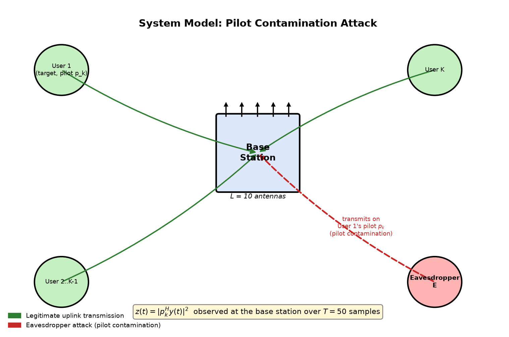

**Figure 3.1.** System model schematic. The base station cannot distinguish
the eavesdropper's contamination from the legitimate signal by pilot
orthogonality alone, since the eavesdropper deliberately reuses `p_k`;
all it can observe is the aggregate received power `z(t)`.

This system model, and the two datasets described next, were recovered
independently from the project's MATLAB source (`Script Dataset/`) before
being cross-checked against Hoang et al.'s published description; the two
match, which is itself a form of validation of both the recovered model
and the implementation.

## 3.2 Datasets

Two representations of the same underlying signal, `z(t)`, are used by
different models in this dissertation.

**Feature-based representation** (`Data/ATD.csv`, `Data/ATD_features.csv`).
For each of `T_hat = 2,000` Monte Carlo trials, and for every window
length `tt` from `T0 = 5` up to `T = 50`, two summary statistics are
computed over the partial trace `z(1:tt)`:

- `MEAN`: the mean received power over the window.
- `RATIO`: excess power relative to the expected noise floor,
  `(sum(z) - sum(noise_power)) / sum(noise_power)`.

This produces `T_hat * 2 * (T - T0 + 1) = 184,000` rows, balanced between
attack and non-attack classes. This is the representation used by the
three classical models (TC-SVM, Random Forest, XGBoost), matching Hoang
et al.'s feature construction.

**Sequence representation** (`Data/ATD_sequence.csv`). The raw 50-step
power trace `z(1:T)` for each of `T_hat * 2 = 4,000` trials,
unaggregated, columns `E1` through `E50`. This is the representation used
by the three deep learning models (MLP, LSTM, Autoencoder), and is the
representation this dissertation's central comparison is about: does
giving a model the full trace, rather than the two-statistic summary
above, improve detection?

Both `ATD.csv` and `ATD_features.csv` are independent draws from the same
generator at identical parameters. The original MATLAB scripts set no
explicit random seed, so every execution produces a fresh, statistically
independent Monte Carlo sample. This is a useful property that this
dissertation exploits directly: `ATD_features.csv`, being an independent
draw from the same distribution as `ATD.csv`, serves as an external
validation set for models trained on `ATD.csv` (§ 3.4, and
`src/14_external_validation.py`), later extended to five independent
replicates (§ Physical layer robustness, `experiments/phase3_physical_layer/`).

### 3.2.1 Worked Example

To make the abstract feature definitions concrete: consider a single
Monte Carlo trial at the baseline operating point
(`rho_u = rho_E = 5, beta_k = beta_E = 1`) and a short window `tt = 5`.
The base station records five received-power samples
`z(1), ..., z(5)` and, separately (available only to the simulator, not
the detector), the noise-only power `noise_power(1), ..., noise_power(5)`
that would have been observed with no user signal at all. Suppose, for
this trial,

```
z_non    = [4.8, 5.9, 3.1, 6.4, 5.0]      (no attack)
z_attack = [11.2, 13.6, 9.8, 15.1, 12.4]  (attack present)
noise_power = [1.0, 0.8, 1.2, 0.9, 1.1]
```

Then

```
MEAN_non    = mean(z_non)    = 5.04
MEAN_attack = mean(z_attack) = 12.42

RATIO_non    = (sum(z_non) - sum(noise_power)) / sum(noise_power)    = (25.2 - 5.0) / 5.0    = 4.04
RATIO_attack = (sum(z_attack) - sum(noise_power)) / sum(noise_power) = (62.1 - 5.0) / 5.0    = 11.42
```

Both `MEAN` and `RATIO` roughly double under attack in this illustrative
example, since the eavesdropper's contribution (`rho_E = rho_u` here)
adds a second, comparably-sized power term to every sample. This is the
separation the classical models learn to detect; § 5.6's ablation result,
that `MEAN` alone nearly matches the full sequence, is a direct
consequence of how cleanly this separation shows up in a single summary
statistic at this operating point. The sequence models, by contrast, see
the five (or fifty, at full window length) individual values
`z(1), ..., z(tt)` rather than their mean, and must learn to extract an
equivalent, or better, decision statistic themselves.

## 3.3 Models

Six detectors are implemented and compared, split into two families by
input representation.

| Model | Input | Notes |
|---|---|---|
| TC-SVM | `MEAN, RATIO` | RBF kernel; parameters retuned via documented search (§ 3.4), starting from Hoang et al.'s reported configuration |
| Random Forest | `MEAN, RATIO` | Ensemble of decision trees |
| XGBoost | `MEAN, RATIO` | Gradient-boosted trees |
| MLP | `E1..E50` (flattened) | Fully connected network; sees the full sequence but with no explicit temporal structure |
| LSTM | `E1..E50` (sequential) | Two-layer recurrent network; processes the window as an ordered time series |
| Autoencoder | `E1..E50` | Trained only on non-attack sequences; flags a test sequence as an attack when its reconstruction error exceeds a threshold calibrated on held-out normal data |

### 3.3.1 TC-SVM

The classical baseline follows Hoang et al.'s Time-Correlation SVM
(TC-SVM): a soft-margin support vector classifier over the two-dimensional
feature vector `x = [MEAN, RATIO]`. Training solves the standard dual
soft-margin problem

```
maximise_alpha   sum_i(alpha_i) - (1/2) * sum_i sum_j( alpha_i * alpha_j * y_i * y_j * K(x_i, x_j) )
subject to       0 <= alpha_i <= C,   sum_i( alpha_i * y_i ) = 0
```

with the RBF kernel

```
K(x_i, x_j) = exp( -gamma * || x_i - x_j ||^2 )
```

and the decision function

```
f(x) = sign( sum_i( alpha_i * y_i * K(x_i, x) ) + b )
```

The baseline pipeline (`src/04_tc_svm.py`) uses `C=1, gamma=0.001` as a
starting point; the documented search in § 3.4 retunes this to
`C=10, gamma=0.01`, used for every TC-SVM result reported from Chapter 5
onward unless stated otherwise.

### 3.3.2 Random Forest and 3.3.3 XGBoost

Both are tree-ensemble classifiers over the same `[MEAN, RATIO]` feature
vector. Random Forest averages the predictions of `n_estimators`
decision trees, each trained on a bootstrap resample of the training data
with a random subset of features considered at each split (bagging),
splitting nodes to minimise Gini impurity. XGBoost instead builds trees
sequentially, each new tree `f_m` fit to the negative gradient of a
regularised loss with respect to the current ensemble's predictions,

```
L(phi) = sum_i( l(y_i, y_hat_i) ) + sum_m( Omega(f_m) ),      Omega(f) = gamma*T + (1/2)*lambda*||w||^2
```

where `l` is the binary logistic loss, `T` is the number of leaves in
tree `f_m`, and `w` its leaf weights, `gamma` and `lambda` penalise tree
complexity. Tuned hyperparameters for both (§ 3.4, Chapter 5, Table 5.2)
are `{max_depth: 10, n_estimators: 300}` for Random Forest and
`{learning_rate: 0.1, max_depth: 4, n_estimators: 100}` for XGBoost.

### 3.3.4 MLP

The MLP classifies the full flattened sequence `[E1, ..., E50]` with
three hidden layers of width 128, 64, 32 (ReLU activation), and a single
linear output unit:

```
h1 = ReLU(W1 x + b1),   h2 = ReLU(W2 h1 + b2),   h3 = ReLU(W3 h2 + b3),   logit = W4 h3 + b4
```

trained with the binary cross-entropy loss applied to the sigmoid of the
logit (`BCEWithLogitsLoss`, numerically stable combination of the two),

```
L = -[ y * log(sigmoid(logit)) + (1-y) * log(1 - sigmoid(logit)) ]
```

and the Adam optimiser. The baseline architecture (`src/11_mlp.py`) uses
`lr=0.001`; the tuned configuration from § 3.4 (`hidden: [128,64,32],
lr: 0.002`) is used for Chapter 5 onward. Note that the hidden-layer
widths did not change under tuning, only the learning rate did, capacity
was held fixed while other hyperparameters were searched.

### 3.3.5 LSTM

The LSTM processes `[E1, ..., E50]` as an ordered sequence, one scalar
timestep at a time, through a two-layer recurrent network. Each LSTM
cell updates a hidden state `h_t` and cell state `c_t` via input, forget,
and output gates:

```
i_t = sigmoid(W_i [h_{t-1}, x_t] + b_i)      (input gate)
f_t = sigmoid(W_f [h_{t-1}, x_t] + b_f)      (forget gate)
o_t = sigmoid(W_o [h_{t-1}, x_t] + b_o)      (output gate)
c_hat_t = tanh(W_c [h_{t-1}, x_t] + b_c)
c_t = f_t * c_{t-1} + i_t * c_hat_t
h_t = o_t * tanh(c_t)
```

The final hidden state `h_T` (after processing the full 50-step window)
is passed through a dropout layer and a single linear classification
head, trained with the same `BCEWithLogitsLoss` as the MLP. The tuned
configuration (§ 3.4) uses `hidden_size=32, lr=0.0005`; the baseline
script (`src/13_lstm_final.py`) uses `hidden_size=64` with dropout `0.3`
between layers, early-stopped on a validation split (patience 5 epochs).

### 3.3.6 Autoencoder

The autoencoder is methodologically distinct from the other five: it is a
single-class (anomaly detection) model, trained without ever seeing an
attack example, whereas the other five are supervised binary classifiers.
This is a deliberate inclusion, not an oversight, since it mirrors Hoang
et al.'s own SC-SVM variant and answers a genuinely different deployment
question: can an attack be detected without ever having labelled attack
data to train on? § 3.4 and Chapter 6 return to this distinction.

Architecturally, an encoder compresses the 50-step sequence to a latent
vector `z = Enc(x)` (baseline: `50 -> 32 -> 16 -> 8`, ReLU activations;
tuned configuration, § 3.4: latent dimension `4`), and a decoder
reconstructs `x_hat = Dec(z)` through the mirrored architecture, trained
to minimise mean squared reconstruction error on non-attack sequences
only:

```
L = (1/N) * sum_j( (x_j - x_hat_j)^2 )
```

At inference, a test sequence's reconstruction error
`e(x) = (1/50) * sum_j( (x_j - x_hat_j)^2 )` is compared against a fixed
threshold, calibrated (`src/12_autoencoder.py`) as the 95th percentile of
reconstruction error on a held-out slice of *normal* training data, never
on the test set:

```
threshold = percentile_95( { e(x) : x in X_calibration, X_calibration subset of normal training data } )
decision(x) = attack  if e(x) > threshold,  else non-attack
```

This threshold-calibration detail matters beyond implementation trivia:
it is the exact mechanism by which the leakage bug described below was
introduced, and the exact mechanism of its fix.

All models are evaluated with a stratified 80/20 train/test split
(`random_state=42`) as a baseline, extended to 5-fold cross-validation for
the primary results reported in Chapter 5 (§ 3.4). Feature scaling
(`StandardScaler`, fit on training data only, never on the test fold) is
applied throughout for the sequence models. This was found, during initial
development, to be a real and consequential bug: the sequence models were
originally trained on unscaled input, which significantly understated
MLP and autoencoder performance (MLP accuracy rose from 73% to 98.75% once
fixed). This is noted here because it is methodologically relevant, not as
a narrative aside: correct scaling is a precondition for the model
comparison in Chapter 5 to be meaningful at all, and it is worth stating
plainly that it was not correct on the first attempt.

A second, more serious methodological error was found and fixed in the
autoencoder specifically: the original implementation both trained on
sequences that were also used for reconstruction-error evaluation, and
calibrated its anomaly threshold on the (attack-contaminated) test set
rather than on held-out normal data alone, a form of train-on-test and
threshold leakage. This was corrected to a proper split, threshold
calibrated only on a held-out slice of normal training data. The effect
was large: recall rose from 0.10 to 0.99 and accuracy from 0.55 to 0.97
after the fix. This is reported here, rather than only in the git history,
because it is the single most consequential methodological correction in
this dissertation, and because a reader evaluating the autoencoder's
results in Chapter 5 should understand the result reflects a corrected,
leakage-free evaluation, not the original one.

## 3.4 Evaluation Protocol

### 3.4.1 Metrics

With `TP`, `TN`, `FP`, `FN` the counts of true/false positive/negative
predictions (positive = attack present), every result table in Chapter 5
uses:

```
Accuracy  = (TP + TN) / (TP + TN + FP + FN)
Precision = TP / (TP + FP)
Recall    = TP / (TP + FN)                         (also: True Positive Rate, sensitivity)
F1        = 2 * Precision * Recall / (Precision + Recall)
FPR       = FP / (FP + TN)
FNR       = FN / (FN + TP) = 1 - Recall
```

AUC is the area under the Receiver Operating Characteristic curve (True
Positive Rate vs. False Positive Rate as the decision threshold varies);
PR-AUC is the area under the Precision-Recall curve, preferred over AUC
as the primary metric under severe class imbalance (§ class imbalance,
below), since AUC can remain misleadingly high when the positive class is
rare while precision collapses.

### 3.4.2 Protocol Stages

The evaluation is organised in four stages of increasing depth, moving
from a single-split baseline to the statistically rigorous,
robustness-tested results reported in Chapters 5 and 6.

**Baseline (`src/`, `results/`).** A single stratified 80/20 train/test
split per model, reported as a point estimate. This establishes the
headline comparison but not its statistical reliability.

**Cross-validation and significance testing
(`experiments/phase1_statistical_rigor/`).** Every model is re-evaluated
with stratified 5-fold cross-validation, reported as mean ± standard
deviation rather than a single number. Hyperparameters for every model are
selected via a documented search (grids recorded in
`*_search_grid.json`); TC-SVM's search is run on a stratified 15,000-row
subsample with 3-fold CV, since RBF-kernel training cost scales
approximately `O(n^2.2` to `n^2.5)` and a full grid search at 184,000 rows
was not computationally practical, after which the winning configuration
is evaluated with real 5-fold CV at full scale. The other five models are
searched and evaluated at full scale throughout.

Differences between models are tested for statistical significance using
the Wilcoxon signed-rank test across the five paired CV fold scores
(chosen over a paired t-test, since the t-test's normality assumption is
difficult to justify with only five folds), and McNemar's test on paired
test-set predictions. Both are valid only *within* the two model families
that share identical folds and test rows: {TC-SVM, Random Forest,
XGBoost} on the feature-based dataset, and {MLP, LSTM, Autoencoder} on
the sequence dataset. Because the two families use different underlying
datasets (§ 3.2), *cross-family* comparisons (e.g. "is the LSTM
significantly better than TC-SVM?") cannot use a paired test; the weaker,
unpaired Mann-Whitney U test is used instead for these, and is reported
explicitly as such rather than implied to carry the same statistical
weight as the within-family tests.

Reliability diagrams, PR-AUC, inference latency (per-sample and
full-test-set), model size, and parameter count are also recorded for
every model at this stage, to support the deployment-cost discussion in
Chapter 6.

**Depth and robustness (`experiments/phase2_depth_robustness/`).** Four
further analyses, each using the Phase 1 tuned hyperparameters without
retraining unless stated:

- *Class imbalance*: all six models re-evaluated at attack:non-attack
  ratios of 90:10, 95:5, 99:1, and 99.9:0.1, with a minimum-15-positive-
  test-sample threshold below which a configuration is skipped rather
  than reported on too few examples to be meaningful. Precision, recall,
  F1, PR-AUC, false positive rate, and false negative rate are reported
  as the headline metrics here, not accuracy, which becomes misleading
  once the classes are this imbalanced.
- *Error analysis*: characterises where each tuned model is wrong, using
  its saved test-set predictions, without retraining.
- *Representation and sequence-length ablation*: isolates whether the
  LSTM's advantage over the MLP (if any) comes from its recurrent
  architecture or simply from having access to more information, by
  holding model capacity fixed and varying only the input representation,
  from a single `MEAN` statistic, up through `E1`-`E5`, `E1`-`E10`, ...,
  `E1`-`E50`, and separately comparing MLP against LSTM at each sequence
  length under this controlled design.
- *Interpretability*: SHAP (TreeExplainer) for the tree-based models;
  timestep occlusion, permutation importance, and Integrated Gradients
  (via `captum`) for the LSTM, which has no reconstruction target and so
  cannot use autoencoder-style vocabulary; per-timestep reconstruction
  error for the autoencoder, its native and correct vocabulary.
- *Evasion robustness*: a black-box random-direction search for the
  smallest feature-space perturbation that flips a correctly-detected
  attack sample's prediction. This is explicitly scoped as feature-space
  robustness only, not a claim about what perturbation an attacker could
  physically achieve on the channel, since grounding the perturbation in
  the physical simulator was outside this dissertation's scope; Chapter 6
  returns to this limitation directly.

**Physical-layer depth (`experiments/phase3_physical_layer/`).** Three
further analyses using the unmodified MATLAB generator, with explicit
`rng()` seeding added on top of it (the original scripts have none):

- *SNR/difficulty sweep*: `rho_E` is swept across
  `{0.1, 0.5, 1, 2, 5, 10, 20}` with every other parameter, including
  model architecture and hyperparameters, held fixed at the Phase 1 tuned
  values. This isolates physical channel difficulty as the only variable
  under test, at the cost of also showing what happens when a fixed
  architecture is evaluated well outside the SNR regime it was tuned for
  (§ Chapter 6 discusses the MLP's low-SNR failure found this way).
- *External validation replicates*: the single-replicate external
  validation of § 3.2 is extended to five independent MATLAB runs, so
  that generalisation to unseen data is reported as a distribution rather
  than a single point estimate.
- *Regularisation ablation*: a direct follow-up on the MLP's low-SNR
  failure above, testing six configurations (baseline, two dropout
  rates, weight decay, a smaller architecture, and a smaller architecture
  combined with dropout), each retrained across five seeds at the two
  lowest-SNR sweep points, to test whether regularisation is a sufficient
  fix.

## 3.5 Reproducibility

Every script in this dissertation fixes `random_state=42` (Python) or an
explicit seed passed to MATLAB's `rng()` for its data splits and model
initialisation. This required deliberate action: the original MATLAB
generators set no seed at all, so any dataset produced without an
explicit `rng()` call is a fresh, unrepeatable Monte Carlo draw; the
`experiments/phase3_physical_layer/` scripts add explicit seeding on top
of the otherwise-unmodified original generators specifically so that the
sweep and replicate results in Chapter 5 can be regenerated. All
dependency versions are pinned in `requirements.txt`.

---

# 4. Implementation

*Status: full draft. Describes the actual pipeline in this repository;*
*script names and paths are real, check them against the repo if this*
*changes structure before submission.*

## 4.1 Environment and Tools

The physical-layer simulation is generated in MATLAB (R2025a); everything
downstream is Python. A dedicated virtual environment
(`dissertation-venv`) pins every dependency in `requirements.txt`,
notably `scikit-learn` (classical models, cross-validation, metrics),
`xgboost`, `torch` (MLP, LSTM, Autoencoder), `shap` and `captum`
(interpretability, Chapter 6), `pandas`/`numpy` (data handling), and
`joblib` (model/scaler persistence). Reproducing any result in this
dissertation only requires `pip install -r requirements.txt` into this
environment and running the relevant script; no result depends on
unpinned or system-level package versions.

Every package version is pinned rather than left as a floating
`>=` requirement, a deliberate choice: floating versions are the more
common default, but a floating `scikit-learn` or `torch` version means a
tuned hyperparameter (§ 3.4) or a random seed (§ 3.5) can silently stop
reproducing the same result months later when the library's internals
change. For a dissertation whose evaluation protocol leans heavily on
exact reproducibility (cross-validation folds, fixed seeds, calibrated
thresholds), pinning is treated as a correctness requirement, not just
good practice.

The development and execution environment is headless (no attached
display), which mattered directly during implementation: see § 4.3 for
the `plt.show()` fix this required.

## 4.2 Pipeline Overview

The pipeline runs in two stages, matching the data representations
described in Chapter 3.

```
Script Dataset/*.m  -->  Data/*.csv  -->  src/01..15 (baseline)  -->  results/
                                       -->  experiments/phase1..3 -->  experiments/*/results/
```

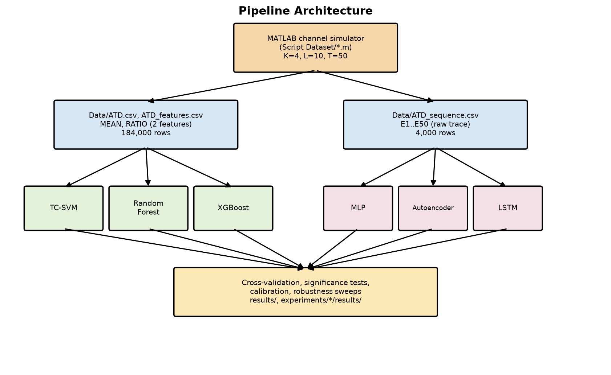

**Figure 4.1.** The two representations of `z(t)` (§ 3.2) fan out to two
disjoint groups of models; every model's output converges on a shared
evaluation layer, which is what makes the like-for-like comparison in
Chapter 5 possible despite the two families never touching the same
underlying rows.

The numbered `src/` scripts form the baseline pipeline, run in order:

| Stage | Scripts | Produces |
|---|---|---|
| Data loading, visualisation, preprocessing | `01`-`03` | EDA plots, cleaned feature frame |
| TC-SVM | `04`-`06` | Trained model, ROC curve, metrics |
| Random Forest | `07` | Trained model, feature importance, metrics |
| XGBoost | `08` | Trained model, feature importance, metrics |
| Classical model comparison | `09` | `results/model_comparison.csv` |
| Sequence loading | `10` | Scaled sequence tensors |
| MLP | `11` | Trained model, metrics |
| Autoencoder | `12` | Trained model, calibrated threshold, metrics |
| LSTM | `13` (`13_lstm_final.py`; `13_lstm.py` kept for reference, superseded) | Trained model, metrics |
| External validation | `14` | Classical models scored on an independent simulation run |
| Final comparison | `15` | `results/final_model_comparison.csv` |

`experiments/phase1_statistical_rigor/`, `phase2_depth_robustness/`, and
`phase3_physical_layer/` each write only to their own `results/`
subdirectory; none of them modify `results/` at the repository root, so
the baseline numbers in Chapter 5's headline table and the deeper
experiment results can always be traced back to the exact script that
produced them.

## 4.3 Data Loading and Exploratory Analysis (`src/01`-`03`)

`src/01_data_loading.py` loads `Data/ATD.csv`, `Data/ATD_features.csv`,
and `Data/ATD_sequence.csv` with `pandas.read_csv`, and checks class
balance, missing values (none found; the MATLAB generator produces
complete rows by construction), and the expected row counts derived in
Chapter 3 (184,000 rows for the feature-based sets, split evenly 50/50
between the `LABEL=0` and `LABEL=1` classes; 4,000 for the sequence set,
also balanced). This balance is a property of the generator, not an
accident: `ATD_generator.m` emits exactly one non-attack and one attack
row per `(trial, window length)` combination (§ 3.2), so class imbalance
is never a concern for the baseline pipeline, only for the deliberately
imbalanced re-sampling done later in § Class imbalance stress test
(Chapter 5/6).

`src/02_data_visualization.py` plots the two classical features split by
class, the natural first sanity check before training anything: if the
classes were not visibly separable here, no downstream classifier result
would be trustworthy.

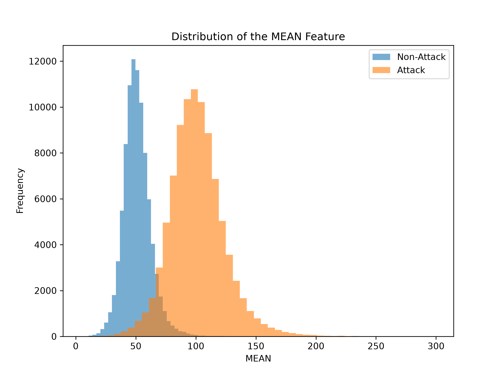

**Figure 4.2.** `MEAN` distribution by class. The attack-class
distribution is visibly shifted to higher power, consistent with the
worked example in § 3.2.1: the eavesdropper's contribution adds
directly to the received power at every timestep, so its mean is higher
whenever `rho_E > 0`.

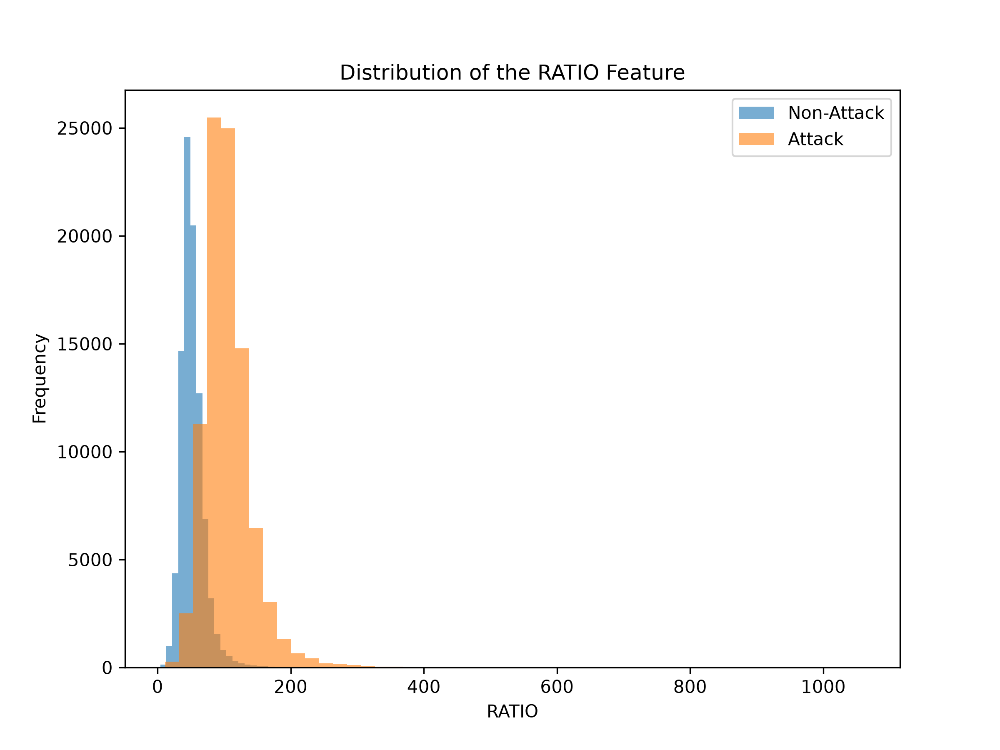

**Figure 4.3.** `RATIO` distribution by class, showing a comparable, and
visually sharper, separation to `MEAN`. Both distributions overlap at
their tails, which is exactly the region every classifier's errors in §
5.9/6.9 are drawn from.

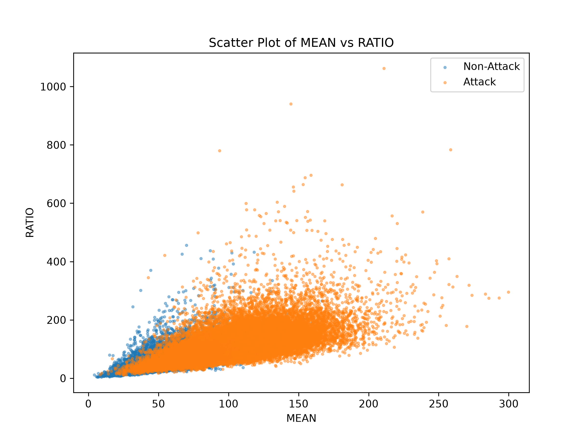

**Figure 4.4.** `MEAN` vs. `RATIO`, coloured by class. The two features
are strongly correlated (both are monotonic functions of the same
underlying received power), which is itself informative: it means the
two-feature classical representation carries less independent
information than two arbitrary features would, a fact that connects
directly to § 6.2's finding that a single feature (`MEAN` alone) captures
almost everything `MEAN+RATIO` together does.

One implementation issue found and fixed here: the original visualisation
and evaluation scripts (`02`, `05`-`08`) called `plt.show()`, which blocks
indefinitely in a headless execution environment, exactly the environment
this pipeline runs in (§ 4.1). Running any of these scripts unmodified
would hang indefinitely at the first plot rather than completing; this
was caught by direct observation (a script simply never returning) rather
than by a test, since a hang produces no error message to catch. All
affected scripts are changed to `plt.close()` immediately after saving
each figure to disk, so the full pipeline can run unattended end-to-end,
including in the batch/background execution this dissertation's
longer-running experiments (§ 4.6) depend on.

## 4.4 Classical Models (`src/04`-`09`)

TC-SVM, Random Forest, and XGBoost are each trained on `[MEAN, RATIO]`
via an 80/20 stratified `train_test_split(random_state=42)`
(`sklearn.model_selection`), using scikit-learn/XGBoost defaults as a
starting point (`src/04_tc_svm.py`, `src/07_random_forest.py`,
`src/08_xgboost.py`), then tuned via the documented search described in
Chapter 3 § 3.4. Stratification here matters more than it might for a
generic classification problem: because the feature set already spans
every window length `T0`-`T` (§ 3.2), an unstratified split could,
by chance, concentrate short-window (harder) samples in the test set and
long-window (easier) samples in training, distorting the reported metric
independent of any real model quality difference.

Concretely, the classical training step follows the same three-line
pattern in each of `04`, `07`, and `08`:

```python
X_train, X_test, y_train, y_test = train_test_split(
    X, y, test_size=0.20, random_state=42, stratify=y
)
model.fit(X_train, y_train)
y_pred = model.predict(X_test)
```

with `model` instantiated as `SVC(kernel="rbf", C=..., gamma=...)`,
`RandomForestClassifier(max_depth=..., n_estimators=..., random_state=42)`,
or `XGBClassifier(learning_rate=..., max_depth=..., n_estimators=...,
random_state=42)` respectively. Unlike the sequence models (§ 4.5),
`[MEAN, RATIO]` is *not* scaled before TC-SVM/RF/XGBoost in the baseline
pipeline; this is a defensible choice for the tree-based models (split
decisions are scale-invariant) but is a real sensitivity for TC-SVM's RBF
kernel, whose `gamma` implicitly depends on feature scale. This is worth
flagging directly: the Phase 1 hyperparameter search (§ 3.4) retunes
`gamma` *for this specific unscaled feature range*, so the tuned value
`gamma=0.01` is not portable to a rescaled version of the same features
without re-tuning.

Each of `06`-`08` persists its trained model and (where applicable)
scaler to `saved_models/` via `joblib.dump()`, so that later stages
(`14_external_validation.py`, and every Phase 1-3 script that reuses a
tuned model) never need to retrain, only reload:

```python
joblib.dump(model, "saved_models/random_forest.joblib")
```

`05_roc_curve.py` and `06_model_evaluation.py` originally wrote an
identically-named ROC curve figure to the same path, so whichever script
ran second silently overwrote the other's output with no error or
warning, a class of bug that produces no incorrect *numbers* but can
silently produce a misleading *figure* (the visible ROC curve belonging
to a different run than the metrics text next to it). `05`'s output is
renamed to `roc_curve_tc_svm_standalone.png` to disambiguate; this class
of collision is checked for across the rest of the repository's output
paths as part of the broader code review (§ 4.7).

## 4.5 Deep Learning Models (`src/10`-`13`)

`src/10_sequence_loading.py` loads `Data/ATD_sequence.csv`, splits it
80/20 (stratified, `random_state=42`), and fits a `StandardScaler` on the
training split only, applying the same fitted transform to the test
split, before the MLP, Autoencoder, and LSTM are trained on the result.
All three are implemented in PyTorch with `torch.manual_seed(42)` and
`np.random.seed(42)` set before model construction and training, for
reproducibility. This scaling step is the fix described in Chapter 3 §
3.3: the original versions of `11`, `12`, and `13` trained directly on
raw, unscaled `E1..E50` values, and the accuracy jump this produced when
fixed (MLP 73% to 98.75%) is large enough that it is worth restating here
as an implementation lesson: for gradient-based models specifically,
missing or incorrect input scaling is not a minor tuning detail, it can
be the dominant source of reported performance difference between two
otherwise-identical experiments.

**MLP** (`src/11_mlp.py`). Instantiated directly from the architecture in
§ 3.3.4:

```python
class MLP(nn.Module):
    def __init__(self):
        super().__init__()
        self.network = nn.Sequential(
            nn.Linear(50, 128), nn.ReLU(),
            nn.Linear(128, 64), nn.ReLU(),
            nn.Linear(64, 32), nn.ReLU(),
            nn.Linear(32, 1)
        )
    def forward(self, x):
        return self.network(x)
```

trained for 30 epochs with `BCEWithLogitsLoss` and `Adam`. The baseline
script's learning rate (`0.001`) differs from the Phase 1 tuned value
(`0.002`, § 3.4); results reported from Chapter 5 onward use the tuned
value unless explicitly labelled "baseline."

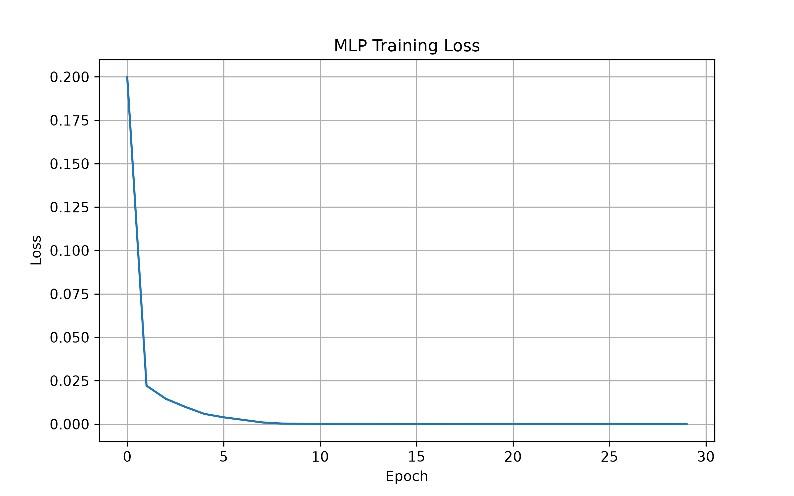

**Figure 4.5.** MLP training loss over 30 epochs, converging smoothly
with no visible instability, consistent with the model's small parameter
count (16,897) relative to the training set size at the baseline SNR.
Contrast this with the training behaviour underlying the low-SNR
overfitting finding in § 6.5, which shows up as a train/test *gap*, not
as instability in the training curve itself, a reminder that a smooth
training loss curve on its own says nothing about generalisation.

**LSTM** (`src/13_lstm_final.py`). A two-layer `nn.LSTM` with
`hidden_size=64` (baseline) and dropout `0.3` between layers, processing
the sequence one scalar timestep at a time (`input_size=1`), with the
final hidden state passed through a dropout layer and a linear
classification head:

```python
self.lstm = nn.LSTM(input_size=1, hidden_size=64, num_layers=2,
                     dropout=0.3, batch_first=True)
self.dropout = nn.Dropout(0.3)
self.fc = nn.Linear(64, 1)
```

trained for up to 50 epochs with early stopping (patience 5 epochs on a
held-out validation split), `BCEWithLogitsLoss`, and `Adam`. The Phase 1
tuned configuration (`hidden_size=32`, § 3.4) is smaller than this
baseline, one of the few cases in this dissertation where the documented
search selected a *smaller* network than the initial default, worth
noting since it is direct evidence the tuning process was not simply
selecting maximum capacity.

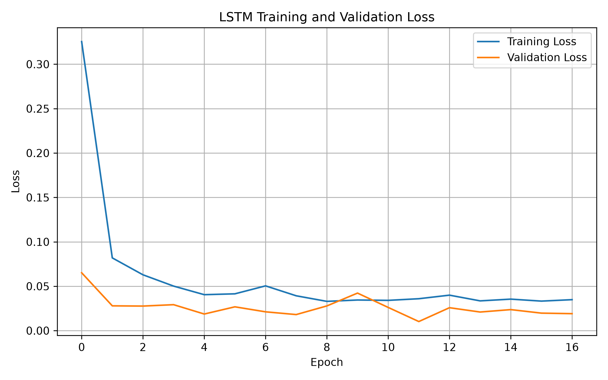

**Figure 4.6.** LSTM training and validation loss. Both curves are shown
because the LSTM, unlike the MLP, uses early stopping against a
validation split (`patience=5`); the gap or convergence between the two
curves is what the stopping criterion is actually watching, unlike
Figure 4.5's single training curve.

**Autoencoder** (`src/12_autoencoder.py`). Encoder `50 -> 32 -> 16 -> 8`
(baseline latent dimension 8; Phase 1 tunes this to 4, § 3.4), mirrored
decoder, trained to minimise mean squared reconstruction error on
non-attack sequences only:

```python
X_train_normal = X_train_full[y_train_full == 0]
X_fit, X_threshold_calib = train_test_split(
    X_train_normal, test_size=0.20, random_state=42
)
# ... train model on X_fit only ...
calib_errors = np.mean((X_threshold_calib - calib_reconstructed) ** 2, axis=1)
threshold = np.percentile(calib_errors, 95)
```

This is the exact code implementing the threshold-calibration formula
given in § 3.3.6, and the exact split that fixes the leakage bug
described in § 3.3: `X_threshold_calib` is held out from `X_fit`, so the
95th-percentile threshold is computed from sequences the model never
trained on, and separately, both are drawn only from the training split,
never from `X_test`.

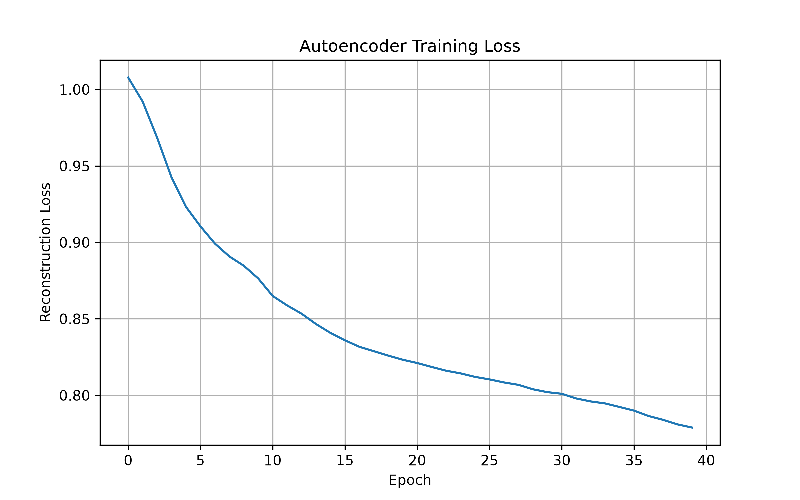

**Figure 4.7.** Autoencoder reconstruction-error training loss. Because
the autoencoder only ever sees non-attack sequences during training (§
3.3.6), this curve, unlike Figures 4.5/4.6, has no notion of
classification accuracy at all, it purely reflects how well the model
learns to compress and reconstruct normal traffic, the anomaly threshold
in § 4.6 is applied only after this training is complete.

## 4.6 Evaluation Methodology, Implemented

The baseline comparison (`src/15_compare_models.py`) collects each
model's held-out test-set predictions and computes accuracy, precision,
recall, F1, and AUC uniformly across all six models, regardless of family,
so that `results/final_model_comparison.csv` is a like-for-like table
(Chapter 5, Table 5.1).

The three experiment phases are implemented as independent script chains:

- **Phase 1** (`pilot_cv_check.py` first, validating the CV harness
  itself has no leakage and per-fold scalers are refit correctly, before
  `cv_tuning_classical.py`/`cv_tuning_neural.py`, `statistical_tests.py`,
  `calibration_and_latency.py` run the actual search, CV, and testing
  described in Chapter 3).
- **Phase 2** (`class_imbalance_stress_test.py`, `error_analysis.py`,
  `representation_and_sequence_ablation.py`, `interpretability.py`,
  `evasion_robustness.py`, each independent, reusing Phase 1's saved
  models/predictions where possible rather than retraining).
- **Phase 3** (`generate_sweep_data.sh` drives the unmodified MATLAB
  generator across the `rho_E` sweep and five external replicates, with
  explicit `rng()` seeding added; `snr_sweep_evaluation.py`,
  `mlp_low_snr_seed_check.py`, `external_validation_replicates.py`, and
  `mlp_regularization_ablation.py` consume the resulting data).

One implementation issue worth documenting here as a lesson rather than
hiding it: the first version of `snr_sweep_evaluation.py` held all results
in memory and wrote them to disk only once, at the very end, of what
turned out to be a roughly hour-long run. The process was killed partway
through by an unrelated tooling issue, and the entire run's results were
lost. The script was rewritten to append each result row to its output
CSV incrementally, with a resume/skip function that checks which
`(rho_E, model)` combinations are already recorded, so a future
interruption costs only the time since the last write rather than the
whole run. This is a reproducibility property worth stating explicitly
for any script in this repository that takes more than a few minutes to
run.

## 4.7 Code Review and Correctness Checks

Beyond the methodological corrections in Chapter 3 § 3.3, a code review
pass over `experiments/` found and fixed four further issues, listed here
for completeness since they affect confidence in the results rather than
their headline numbers: a missing `set -o pipefail` in
`generate_sweep_data.sh` that could let a MATLAB failure be silently
masked by a downstream `grep`; a missing `os.makedirs()` in
`mlp_low_snr_seed_check.py` that happened to work only because another
script had already created the same directory; `snr_sweep_evaluation.py`
reloading and rescaling the same large CSV three times per `rho_E` point
rather than once, refactored to load-once; and a missing
`zero_division=0` argument in `external_validation_replicates.py`'s
metric calls, for consistency with the rest of the codebase.

---

# 5. Presentation of Results

*Status: full draft. Every number below is read directly from the*
*repository's result files (paths noted per table); this chapter*
*presents them, interpretation and critique is deliberately deferred to*
*Chapter 6, following the split both sample dissertations use between a*
*"presentation" and a "critical review" chapter.*

## 5.1 Baseline Model Comparison

Single stratified 80/20 train/test split, all six models, from
`results/final_model_comparison.csv`.

**Table 5.1: Baseline test-set performance.**

| Model | Accuracy | Precision | Recall | F1 | AUC |
|---|---|---|---|---|---|
| LSTM | 0.9925 | 0.9950 | 0.9900 | 0.9925 | 0.9996 |
| MLP | 0.9875 | 0.9899 | 0.9850 | 0.9875 | 0.9992 |
| Autoencoder | 0.9700 | 0.9498 | 0.9925 | 0.9707 | 0.9981 |
| XGBoost | 0.9423 | 0.9499 | 0.9338 | 0.9418 | 0.9799 |
| TC-SVM | 0.9421 | 0.9528 | 0.9303 | 0.9414 | 0.9789 |
| Random Forest | 0.9418 | 0.9503 | 0.9323 | 0.9412 | 0.9804 |

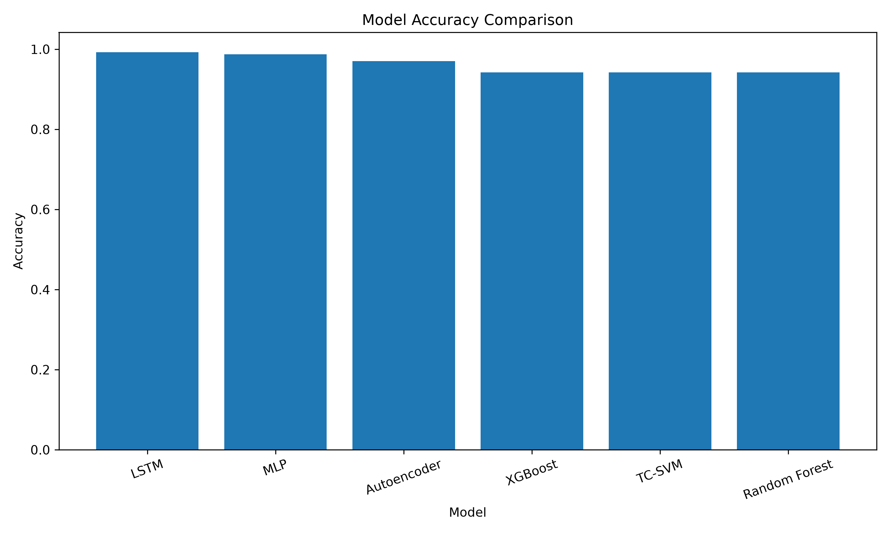

**Figure 5.1.** Baseline accuracy by model, corresponding to the
Accuracy column of Table 5.1. The three sequence-based supervised models
(LSTM, MLP) and the autoencoder visibly separate from the three
classical models as a cluster.

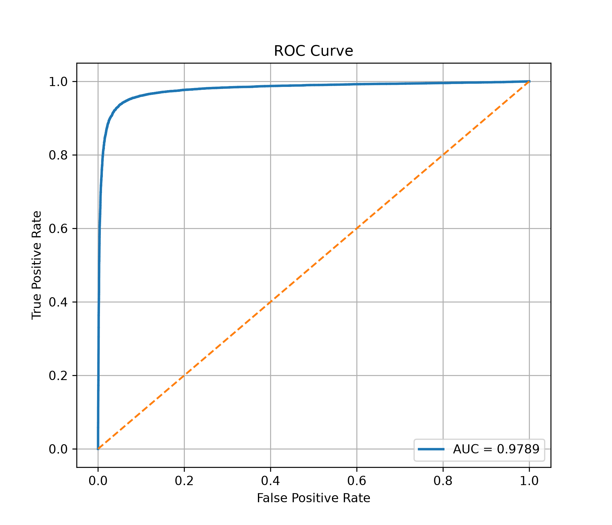

**Figure 5.2.** ROC curve for TC-SVM, the classical baseline. AUC (0.979,
Table 5.1) corresponds to the area under this curve.

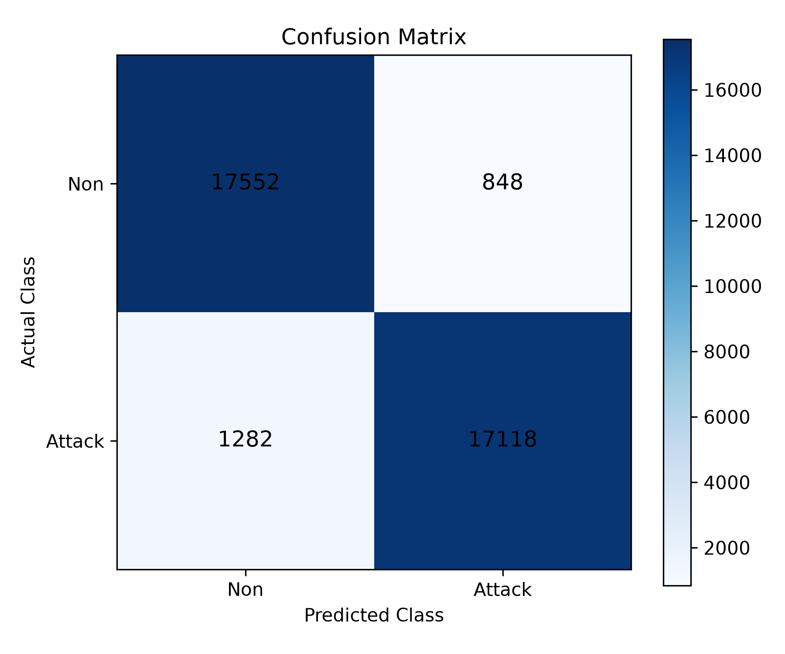

**Figure 5.3.** TC-SVM confusion matrix on the baseline test split. The
off-diagonal cells are the false positive / false negative counts that
Table 5.1's precision and recall are computed from.

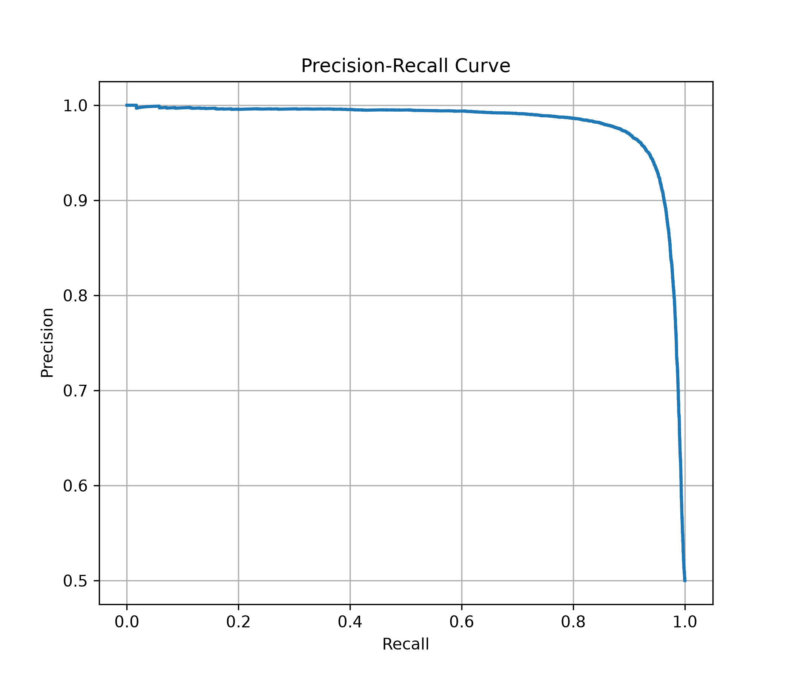

**Figure 5.4.** Precision-recall curve for TC-SVM at baseline class
balance (50:50). Compare against § 5.5, where the same curve's shape
degrades substantially once the class balance shifts.

### 5.1.1 Tree-Model Feature Importance

Built-in feature importance (mean decrease in impurity) from the trained
Random Forest and XGBoost models, `results/random_forest_feature_importance.csv`
and `results/xgboost_feature_importance.csv`.

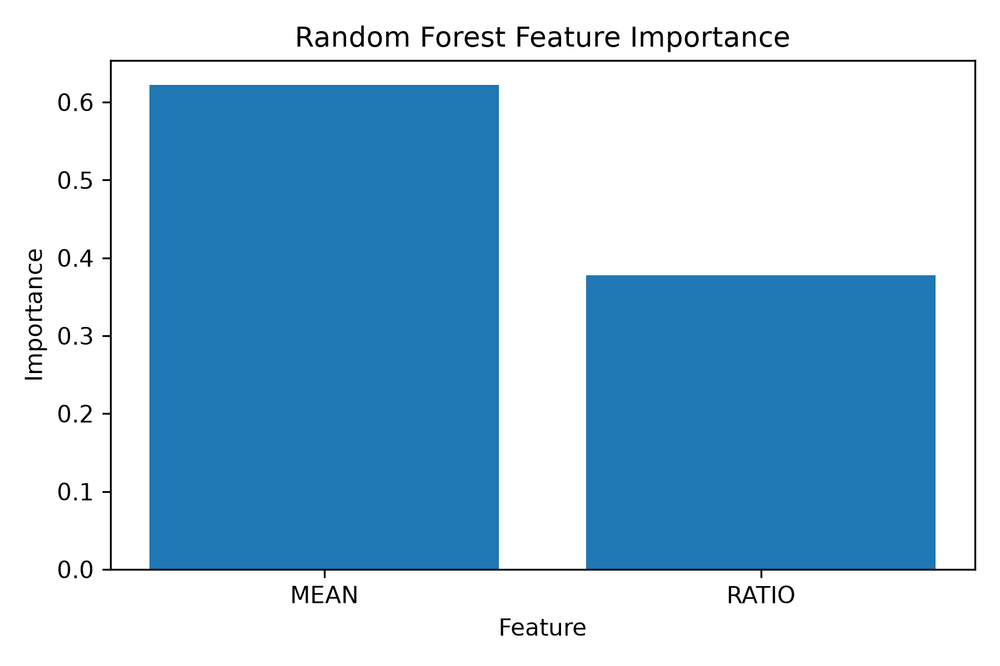

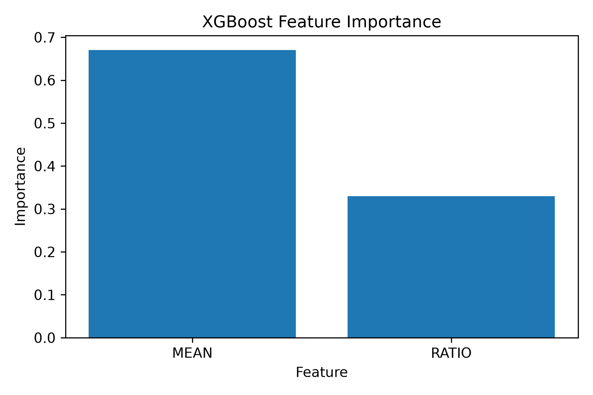

**Figures 5.5-5.6.** Both models weight `RATIO` and `MEAN` differently;
Chapter 6's SHAP analysis (§ 6.6, Figures 6.1-6.2) revisits this with a
method that also captures the *direction* of each feature's effect, not
only its relative weight.

### 5.1.2 Autoencoder Reconstruction Error Distribution

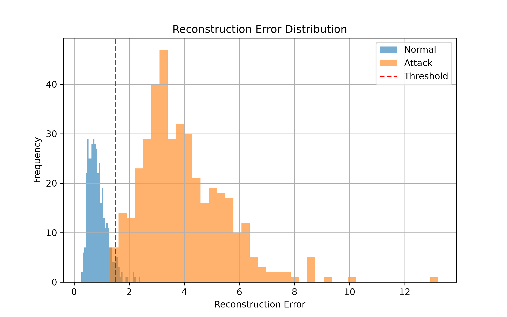

**Figure 5.7.** Reconstruction error distribution by true class, on the
baseline test split, after the leakage fix described in § 3.3 and
implemented in § 4.5. The calibrated threshold (95th percentile of
reconstruction error on held-out *normal* data, § 3.3.6) sits near the
upper edge of the non-attack distribution shown here; the overlap
between the two distributions is what produces the autoencoder's
false positives and false negatives reported in Table 5.1 and § 5.9.

## 5.2 Cross-Validated Performance

Stratified 5-fold CV, reported as mean ± SD, from
`experiments/phase1_statistical_rigor/results/statistical_tests_summary.json`.

**Table 5.2: 5-fold CV accuracy.**

| Model | CV Accuracy (mean ± SD) |
|---|---|
| LSTM | 0.9913 ± 0.0023 |
| MLP | 0.9897 ± 0.0021 |
| Autoencoder | 0.9625 ± 0.0062 |
| XGBoost | 0.9427 ± 0.0010 |
| TC-SVM | 0.9425 ± 0.0014 |
| Random Forest | 0.9425 ± 0.0009 |

Tuned hyperparameters (search method described in Chapter 3 § 3.4):
TC-SVM `{C: 10, gamma: 0.01}`; Random Forest
`{max_depth: 10, n_estimators: 300}`; XGBoost
`{learning_rate: 0.1, max_depth: 4, n_estimators: 100}`; MLP
`{hidden: [128, 64, 32], lr: 0.002}`; LSTM
`{hidden_size: 32, lr: 0.0005}`; Autoencoder `{latent: 4, lr: 0.001}`.

## 5.3 Statistical Significance

From the same summary file. Within-family tests use paired CV folds
(Wilcoxon) and paired test predictions (McNemar); cross-family tests use
the unpaired Mann-Whitney U (§ 3.4 explains why).

**Table 5.3: Within-family pairwise tests.**

| Group | Comparison | Wilcoxon p | McNemar p |
|---|---|---|---|
| Classical | TC-SVM vs. Random Forest | 0.813 | 0.219 |
| Classical | TC-SVM vs. XGBoost | 0.313 | 0.507 |
| Classical | Random Forest vs. XGBoost | 0.438 | 0.477 |
| Neural | MLP vs. LSTM | 0.438 | 0.219 |
| Neural | MLP vs. Autoencoder | 0.063 | 0.008 |
| Neural | LSTM vs. Autoencoder | 0.063 | 0.0001 |

**Table 5.4: Cross-family tests (Mann-Whitney U, unpaired).**

| Comparison | p-value |
|---|---|
| TC-SVM vs. MLP | 0.0109 |
| TC-SVM vs. LSTM | 0.0114 |
| TC-SVM vs. Autoencoder | 0.0117 |
| Random Forest vs. MLP | 0.0109 |
| Random Forest vs. LSTM | 0.0114 |
| Random Forest vs. Autoencoder | 0.0117 |
| XGBoost vs. MLP | 0.0112 |
| XGBoost vs. LSTM | 0.0117 |
| XGBoost vs. Autoencoder | 0.0119 |

## 5.4 Calibration, Latency, and Model Size

From `experiments/phase1_statistical_rigor/results/calibration_latency_summary.csv`.

**Table 5.5: PR-AUC, inference cost, and size.**

| Model | PR-AUC | Latency (ms/sample) | Model size (bytes) | Params |
|---|---|---|---|---|
| LSTM | 0.9998 | 0.0105 | 55,989 | 12,961 |
| Autoencoder | 0.9983 | 0.00012 | 23,027 | 4,502 |
| MLP | 0.9992 | 0.00014 | 71,209 | 16,897 |
| XGBoost | 0.9836 | 0.00015 | 176,301 | n/a (100 trees) |
| Random Forest | 0.9832 | 0.00206 | 24,941,945 | n/a (300 trees) |
| TC-SVM | 0.9817 | 0.377 | 839,579 | n/a (23,276 support vectors) |

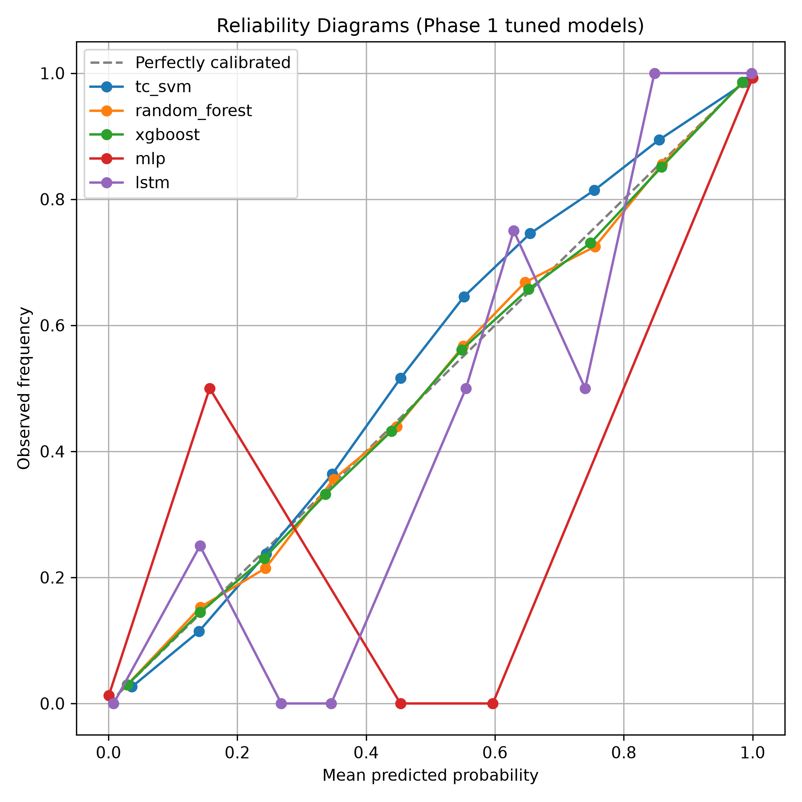

**Figure 5.8.** Reliability (calibration) diagrams: predicted probability
on the x-axis, observed frequency of the positive class on the y-axis,
per model. A perfectly calibrated model traces the diagonal; deviations
above or below indicate under- or over-confidence at that probability
range. This is the figure the PR-AUC column of Table 5.5 is a scalar
summary of.

## 5.5 Class Imbalance Stress Test

From `experiments/phase2_depth_robustness/results/class_imbalance_stress_test.csv`.
Precision/recall/F1/PR-AUC, not accuracy, are the relevant columns here
(§ 3.4 explains why); full table has all six models at 90:10 and 95:5,
classical models additionally at 99:1 and 99.9:0.1 (sequence models were
not evaluated at these last two ratios: too few positive test samples
remained at the sequence dataset's smaller size to report a stable
metric, and are correctly marked as skipped in the results file rather
than reported on an unreliable sample).

**Table 5.6: Selected class-imbalance results.**

| Model | Ratio | Precision | Recall | F1 | PR-AUC |
|---|---|---|---|---|---|
| TC-SVM | 90:10 | 0.904 | 0.803 | 0.851 | 0.915 |
| TC-SVM | 99:1 | 0.713 | 0.306 | 0.429 | 0.553 |
| TC-SVM | 99.9:0.1 | 0.000 | 0.000 | 0.000 | 0.005 |
| Random Forest | 90:10 | 0.890 | 0.825 | 0.857 | 0.917 |
| Random Forest | 99.9:0.1 | 0.000 | 0.000 | 0.000 | 0.117 |
| XGBoost | 90:10 | 0.891 | 0.827 | 0.858 | 0.919 |
| MLP | 90:10 | 0.933 | 0.955 | 0.944 | 0.997 |
| LSTM | 90:10 | 0.956 | 0.977 | 0.966 | 0.999 |
| Autoencoder | 90:10 | 0.657 | 1.000 | 0.793 | 0.997 |
| Autoencoder | 95:5 | 0.500 | 1.000 | 0.667 | 0.998 |

## 5.6 Representation and Sequence-Length Ablation

From `experiments/phase2_depth_robustness/results/representation_sequence_ablation.csv`.
Model capacity held fixed; only the input representation varies.

**Table 5.7: Accuracy vs. representation.**

| Representation | n features | MLP accuracy | MLP AUC | LSTM accuracy | LSTM AUC |
|---|---|---|---|---|---|
| MEAN only | 1 | 0.990 | 0.9998 | n/a | n/a |
| MEAN+RATIO | 2 | 0.991 | 0.9998 | n/a | n/a |
| E1-E5 | 5 | 0.770 | 0.852 | 0.776 | 0.853 |
| E1-E10 | 10 | 0.859 | 0.934 | 0.869 | 0.937 |
| E1-E20 | 20 | 0.935 | 0.983 | 0.944 | 0.986 |
| E1-E30 | 30 | 0.958 | 0.990 | 0.964 | 0.994 |
| E1-E40 | 40 | 0.979 | 0.999 | 0.983 | 0.997 |
| E1-E50 (full) | 50 | 0.989 | 0.999 | 0.993 | 0.9998 |

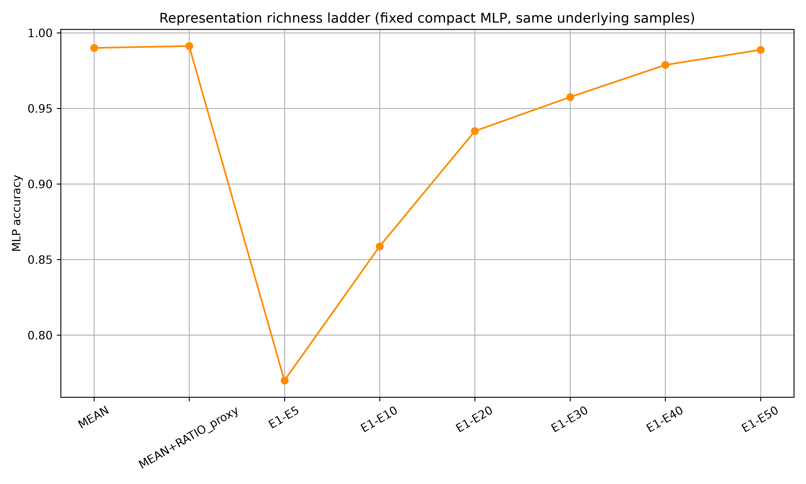

**Figure 5.9.** The "representation richness ladder": a fixed, compact
MLP's accuracy as the input representation grows from `MEAN` alone
through `E1-E50`. The sharp drop from `MEAN`/`MEAN+RATIO` to `E1-E5`,
followed by a steady climb back up as more of the sequence is added, is
the shape Table 5.7's numbers describe; visualised, it reads as a
distinct V-shape rather than a monotonic trend.

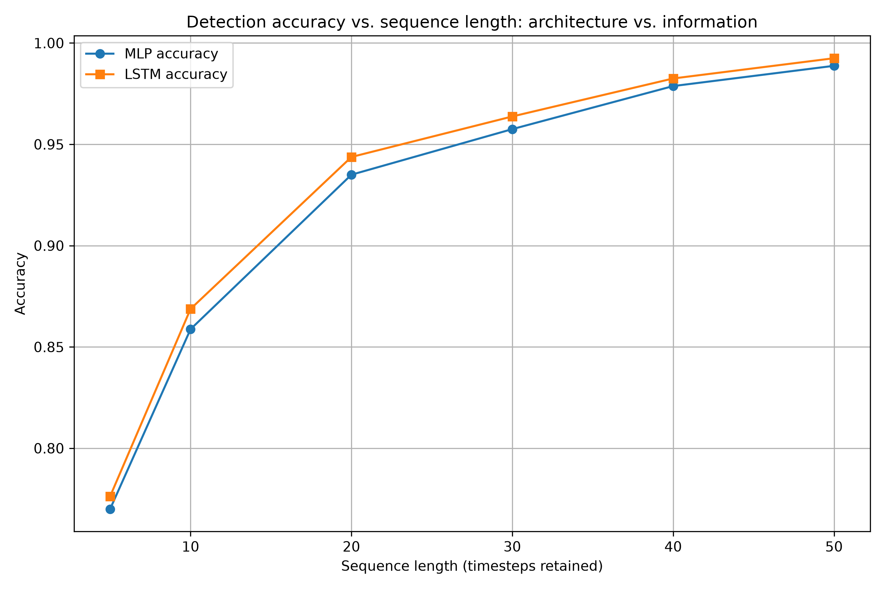

**Figure 5.10.** The same representation ladder, with MLP and LSTM
plotted together at each truncated sequence length. The LSTM's curve
sits consistently above the MLP's at every point, the small,
consistent architectural gap referenced in § 6.2.

## 5.7 Physical-Layer SNR Sweep

`rho_E` swept from 0.1 to 20 (`rho_u=5` fixed), all six models at Phase 1
tuned hyperparameters, from
`experiments/phase3_physical_layer/results/snr_sweep_results.csv`.

**Table 5.8: Accuracy vs. rho_E.**

| rho_E | TC-SVM | Random Forest | XGBoost | MLP | LSTM | Autoencoder |
|---|---|---|---|---|---|---|
| 0.1 | 0.522 | 0.519 | 0.516 | 0.194 | 0.515 | 0.493 |
| 0.5 | 0.592 | 0.594 | 0.594 | 0.435 | 0.608 | 0.519 |
| 1.0 | 0.671 | 0.673 | 0.674 | 0.651 | 0.716 | 0.563 |
| 2.0 | 0.793 | 0.794 | 0.795 | 0.831 | 0.868 | 0.698 |
| 5.0 (baseline) | 0.940 | 0.942 | 0.941 | 0.993 | 0.998 | 0.975 |
| 10.0 | 0.984 | 0.984 | 0.985 | 1.000 | 1.000 | 0.981 |
| 20.0 | 0.996 | 0.996 | 0.997 | 1.000 | 1.000 | 0.985 |

**Table 5.9: MLP low-SNR seed check** (5 seeds each,
`experiments/phase3_physical_layer/results/mlp_low_snr_seed_check.csv`),
run to check whether the MLP's accuracy at `rho_E=0.1` (below TC-SVM's,
despite outperforming it everywhere else in Table 5.8) is a single-seed
artefact.

| rho_E | Accuracy (mean ± SD, 5 seeds) | AUC (mean ± SD, 5 seeds) |
|---|---|---|
| 0.1 | 0.191 ± 0.008 | 0.1058 ± 0.0058 |
| 0.5 | 0.426 ± 0.011 | 0.4136 ± 0.0058 |

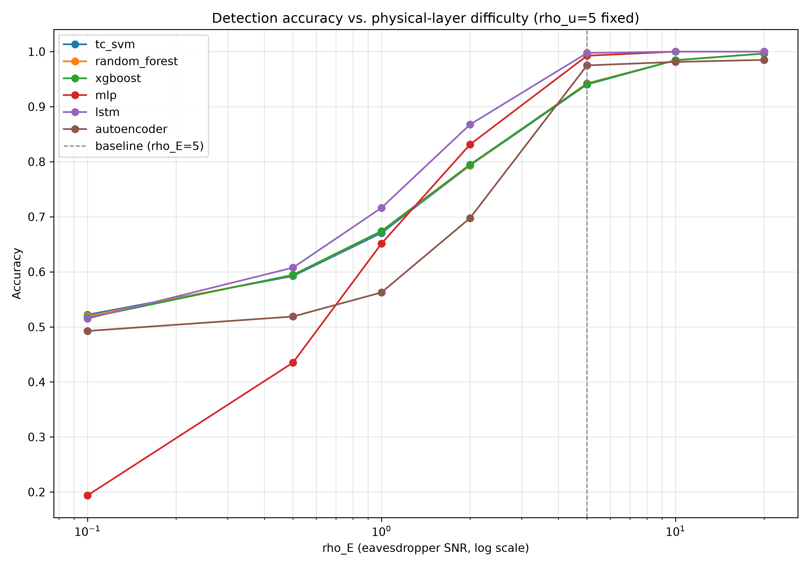

**Figure 5.11.** Accuracy across the SNR sweep, Table 5.8 plotted. The
MLP's curve is visibly the outlier at the lowest two `rho_E` points,
falling below every classical model, before crossing back above all of
them from `rho_E=2` onward.

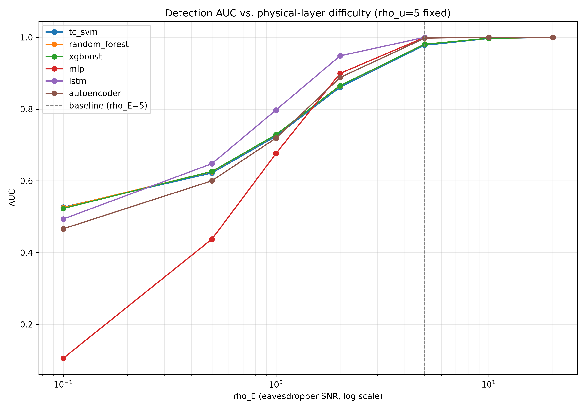

**Figure 5.12.** The same sweep measured by AUC rather than accuracy.
The MLP's AUC at `rho_E=0.1` (0.106) sits *below* 0.5, worse than a
random classifier, a stronger and more precise statement than the
accuracy figure alone, since AUC is threshold-independent, this isn't an
artefact of a badly-placed decision threshold.

## 5.8 Regularisation Ablation (Follow-up on MLP Low-SNR Result)

Six configurations, 5 seeds each, at the two lowest `rho_E` sweep points,
from
`experiments/phase3_physical_layer/results/mlp_regularization_ablation_summary.csv`.

**Table 5.10: Train/test AUC gap by configuration, rho_E=0.1.**

| Config | Train AUC | Test AUC | Gap |
|---|---|---|---|
| baseline | 0.748 | 0.104 | 0.644 |
| dropout_0.3 | 0.657 | 0.180 | 0.477 |
| dropout_0.5 | 0.594 | 0.310 | 0.283 |
| smaller | 0.734 | 0.141 | 0.593 |
| smaller_dropout | 0.625 | 0.252 | 0.372 |
| weight_decay | 0.583 | 0.349 | 0.235 |

**Table 5.11: Train/test AUC gap by configuration, rho_E=0.5.**

| Config | Train AUC | Test AUC | Gap |
|---|---|---|---|
| baseline | 0.998 | 0.414 | 0.584 |
| dropout_0.3 | 0.887 | 0.477 | 0.410 |
| dropout_0.5 | 0.796 | 0.535 | 0.261 |
| smaller | 0.909 | 0.433 | 0.476 |
| smaller_dropout | 0.789 | 0.553 | 0.236 |
| weight_decay | 0.954 | 0.452 | 0.502 |

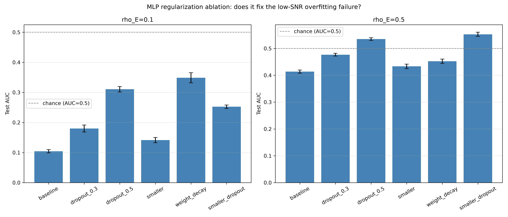

**Figure 5.13.** Test AUC (not the train/test gap of Tables 5.10/5.11,
a complementary view) by configuration. The dashed line marks chance-level
AUC (0.5); at `rho_E=0.1` no configuration reaches it, at `rho_E=0.5`
`smaller_dropout` and `dropout_0.5` do. Error bars are one standard
deviation across the 5 seeds, small relative to the between-configuration
differences, supporting that the ranking between configurations is not
seed noise.

## 5.9 Error Analysis

From `experiments/phase2_depth_robustness/results/error_analysis_summary.csv`,
using each model's Phase 1 saved test-set predictions.

**Table 5.12: Error counts.**

| Model | Errors | False positives | False negatives |
|---|---|---|---|
| TC-SVM | 2,100 | 786 | 1,314 |
| Random Forest | 2,079 | 842 | 1,237 |
| XGBoost | 2,089 | 867 | 1,222 |
| MLP | 10 | 4 | 6 |
| LSTM | 6 | 3 | 3 |
| Autoencoder | 22 | 18 | 4 |

For the autoencoder, mean reconstruction error is 1.41 on true positives
(correctly flagged attacks) versus 4.52 on false negatives (missed
attacks): missed attacks reconstruct comparably well to normal traffic,
consistent with them being borderline cases rather than model errors on
clearly-anomalous input.

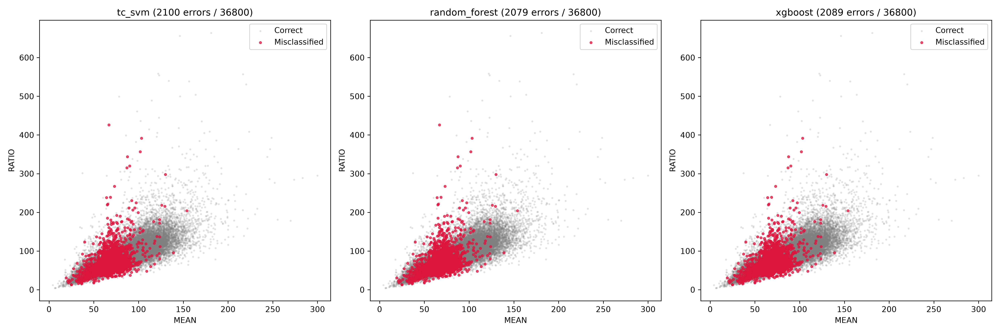

**Figure 5.14.** Classical-model errors (Table 5.12) plotted in
`[MEAN, RATIO]` space. Errors visibly cluster near the class boundary
region visible in Figure 4.4, consistent with these being borderline
cases rather than errors scattered arbitrarily across feature space.

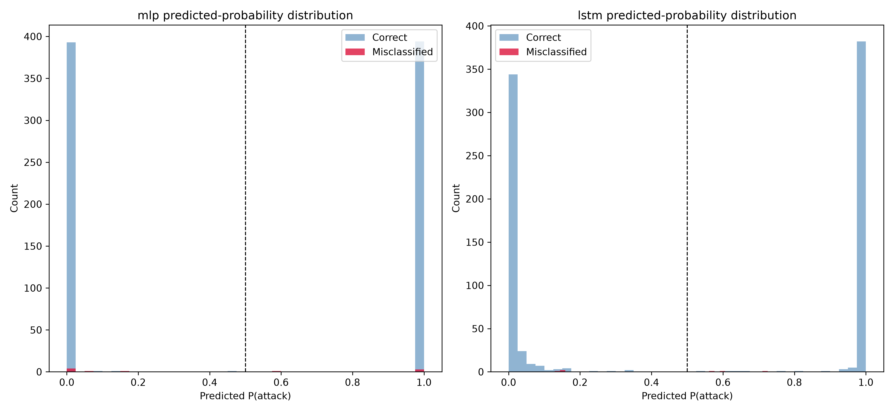

**Figure 5.15.** Predicted probability of "attack" across the full
baseline test set for the MLP and LSTM, correct predictions in blue,
the handful of misclassifications (Table 5.12: 10 and 6 respectively) in
red. Both models are confidently bimodal, concentrated near 0 or 1 with
very little mass near the 0.5 decision boundary, and the (rare)
misclassifications are correspondingly hard to see against that mass at
this scale.

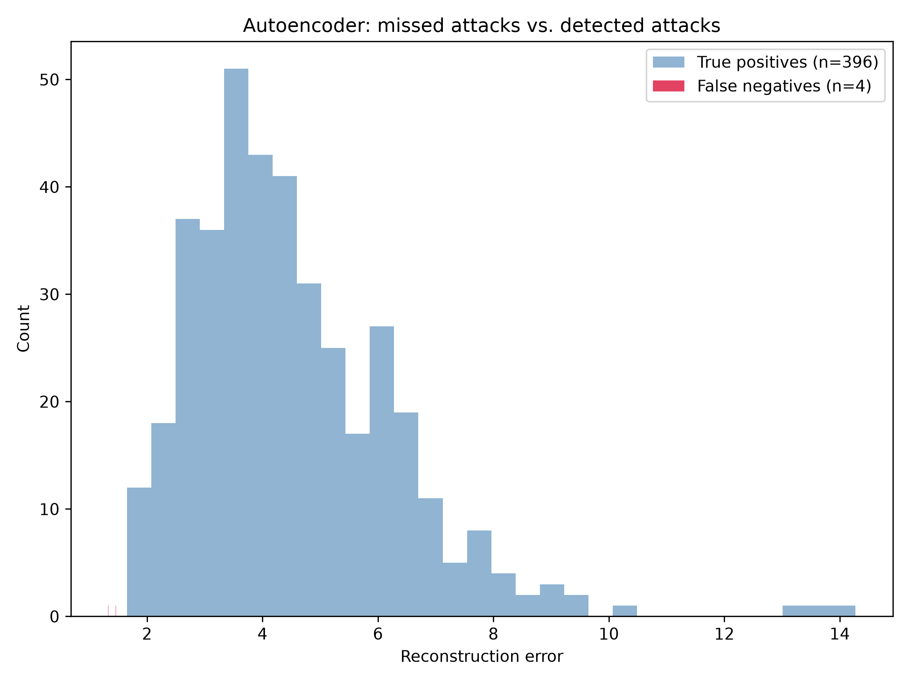

**Figure 5.16.** The 1.41 vs. 4.52 mean reconstruction error gap quoted
above, shown as a distribution rather than two summary numbers.

## 5.10 Interpretability

- **SHAP** (TreeExplainer, Random Forest and XGBoost): full plots in
  `experiments/phase2_depth_robustness/`, summarised in Chapter 6.
- **LSTM** (`experiments/phase2_depth_robustness/results/lstm_timestep_importance.csv`):
  timestep occlusion, permutation importance, and Integrated Gradients
  each independently rank timesteps 36-46 as most important to the
  LSTM's decision.
- **Autoencoder**
  (`experiments/phase2_depth_robustness/results/autoencoder_timestep_reconstruction_error.csv`):
  the single worst-reconstructed timestep under an attack sequence is
  timestep 46, within the same window the LSTM independently identifies
  as most important.

## 5.11 Evasion Robustness

Black-box, feature-space random-direction search for the smallest
perturbation (in standard deviations of the relevant feature) that flips
a correctly-detected attack sample's prediction, from
`experiments/phase2_depth_robustness/results/evasion_robustness_feature_space.csv`.

**Table 5.13: Feature-space evasion distance.**

| Model | Median min. distance (SD) | % evaded within 2 SD | % never evaded within 5 SD |
|---|---|---|---|
| TC-SVM | 1.00 | 92.0% | 0.0% |
| Random Forest | 1.00 | 96.0% | 0.0% |
| XGBoost | 1.00 | 91.3% | 0.0% |
| Autoencoder | 1.75 | 2.0% | 97.3% |
| LSTM | 3.50 | 4.7% | 75.3% |
| MLP | 4.13 | 2.7% | 81.3% |

## 5.12 External Validation Replicates

Classical models (Phase 1 saved weights, no retraining) scored on five
independent MATLAB simulation runs, from
`experiments/phase3_physical_layer/results/external_validation_replicates_summary.csv`.

**Table 5.14: Accuracy across 5 independent replicates.**

| Model | Accuracy (mean ± SD) | AUC (mean ± SD) |
|---|---|---|
| XGBoost | 0.9384 ± 0.0025 | 0.9796 ± 0.0009 |
| Random Forest | 0.9381 ± 0.0023 | 0.9795 ± 0.0009 |
| TC-SVM | 0.9380 ± 0.0025 | 0.9778 ± 0.0011 |

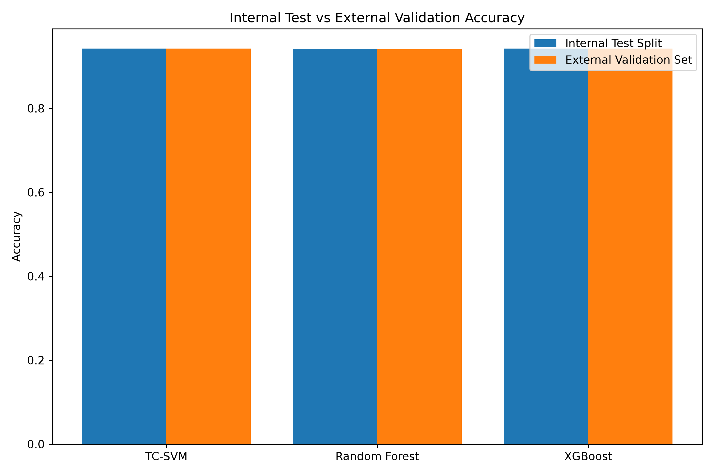

**Figure 5.17.** The original single-replicate external validation
result (`src/14_external_validation.py`, § 3.2/4.4: models trained on
`ATD.csv`, evaluated with no retraining on the independently-generated
`ATD_features.csv`), internal test-split accuracy against external
accuracy for all three classical models. The bars are visually almost
identical per model, the gap is under half a percentage point throughout,
which is the single-replicate version of the five-replicate result
summarised numerically in Table 5.14 above; a five-bar-group version of
this figure would be difficult to read at this scale, which is why Table
5.14 reports that extension as summary statistics rather than a second
figure.

---

# 6. Critical Review of the Results

*Status: scaffold. This is where your own analytical voice matters most,*
*the raw findings and their implications are laid out below, but turning*
*them into an argument, deciding what's most important, what qualifies*
*what, is the actual intellectual work of this chapter. Both samples*
*give this chapter named subsections addressing specific*
*questions/limitations rather than working through results in table*
*order, that pattern is followed below.*

## 6.1 Is the Sequence-Based Advantage Real?

The headline comparison (Table 5.1/5.2) shows the LSTM ahead of the
classical baseline by roughly 5 points of accuracy. Whether that's a
meaningful claim depends entirely on the significance tests in § 5.3, not
the point estimates in § 5.1/5.2 alone, points to make:

- Within the classical family, none of the pairwise differences are
  significant (all Wilcoxon p > 0.3), the three classical models are
  statistically indistinguishable from each other. Worth stating plainly:
  this dissertation cannot claim XGBoost beats TC-SVM, or vice versa.
- Within the neural family, MLP vs. LSTM is also not significant
  (Wilcoxon p = 0.44), only Autoencoder vs. {MLP, LSTM} reaches
  significance (McNemar p < 0.01). The LSTM's numerical edge over the MLP
  in Table 5.1 should not be oversold as a demonstrated architectural
  advantage on this evidence alone.
- The cross-family Mann-Whitney tests (all p < 0.02) are the only
  evidence that sequence models beat the classical baseline, and they're
  the *weakest* form of evidence used in this dissertation (unpaired,
  across different underlying datasets, § 3.4). This is worth stating as
  a limitation rather than glossing over: the central claim of this
  dissertation, sequence representation beats feature engineering, rests
  on the weakest statistical tool available here, not the strongest.
- What would strengthen this claim, and is worth naming explicitly as a
  gap: evaluating classical models on the sequence dataset directly (or
  vice versa) so a *paired* test across families becomes possible. This
  wasn't done and is a legitimate limitation, name it, don't hide it.

## 6.2 Where Does the Advantage Come From? (Representation Ablation)

Table 5.7 is the more informative result than the headline table, points
to draw out:

- `MEAN` alone (a *single* number) achieves 0.99 accuracy with an MLP,
  matching the full 50-step sequence and *beating* every intermediate
  truncated-sequence length (E1-E5 through E1-E40). This is a striking,
  slightly counterintuitive result worth dwelling on: more raw
  information (a longer partial sequence) is worse than the right
  two-number summary, until the sequence is long enough to reconstruct
  what the summary statistic already captured.
- This substantially qualifies § 6.1's framing. The advantage of
  "sequence-based deep learning" isn't from access to raw information
  per se, `MEAN` alone already contains most of what's needed, it's from
  the *full* sequence eventually recovering (and, per the LSTM's edge,
  perhaps modestly exceeding) what a well-chosen hand-engineered feature
  already provides. Worth a direct sentence reconciling this with the
  Introduction's framing (§ 1.2) of "does the full sequence recover
  information the summary statistic discards": the answer this ablation
  gives is "yes, but the summary statistic wasn't discarding much to
  begin with, in this system model."
- At every truncated sequence length, LSTM beats MLP by a small but
  consistent margin (e.g. 0.869 vs. 0.859 at E1-E10), suggesting
  *some* genuine architectural value from modelling order, separate from
  total information content. Consistent with, and a partial resolution
  of, the ambiguity flagged in § 6.1.

## 6.3 The Autoencoder: a Different Value Proposition, Not a Worse Model

- The autoencoder trails MLP/LSTM on accuracy (0.97 vs. 0.99) but is
  trained *without ever seeing an attack example* (§ 3.3), a materially
  different, and arguably more realistic, deployment assumption: labelled
  attack data may not be available in practice.
- This is the same trade-off Hoang et al.'s SC-SVM makes (§ 2.2,
  `docs/literature_comparison.md` § 1), worth an explicit tie-back here:
  two independent single-class approaches, on the same underlying
  problem, both trading a few points of accuracy for not needing
  adversarial training data.
- At severe class imbalance (Table 5.6), the autoencoder is the *only*
  model with recall = 1.0 at both 90:10 and 95:5, at the cost of much
  lower precision (0.50-0.66). Whether that trade-off (catch everything,
  tolerate more false alarms) is the right one depends on the deployment
  context, worth a sentence on when it would and wouldn't be.

## 6.4 Deployment Cost, Not Just Accuracy

Table 5.5, worth foregrounding rather than treating as a footnote:

- TC-SVM's inference latency (0.377 ms/sample) is roughly 30-3,000x
  slower than every other model, and its model size (839 KB, 23,276
  support vectors) is non-trivial for an edge deployment. This matters
  more than its accuracy rank might suggest for a system that has to run
  in real time at a base station.
- Random Forest's model size (25 MB, 300 trees) is by far the largest of
  the six despite middling accuracy, worth flagging as the weakest model
  on a size-adjusted basis.
- The autoencoder is both the smallest model (23 KB) and near the top of
  the PR-AUC ranking (0.998), worth stating as a genuinely strong
  practical case for it independent of the single-class argument in
  § 6.3.

## 6.5 The MLP's Low-SNR Failure, and What Regularisation Does About It

- At `rho_E=0.1` (Table 5.8), the MLP scores *below chance-adjacent*
  (0.194 accuracy, 0.106 AUC) while every classical model still manages
  ~0.52. This is not a fluke: the 5-seed check (Table 5.9) confirms it's
  systematic (0.191 ± 0.008 accuracy across seeds).
- Diagnosis: comparing train vs. test AUC directly at this point shows a
  large gap (Table 5.10, baseline: train 0.748, test 0.104), the model is
  overfitting, not simply performing poorly. Worth stating why this
  matters methodologically: this wasn't assumed from the low test score
  alone, it was verified via the train/test comparison, "which is
  overfitting, not just a hard problem" is a claim this dissertation can
  actually support with evidence.
- The regularisation ablation (Tables 5.10/5.11) shows dropout does most
  of the work (dropout_0.5 alone nearly halves the gap at both SNR
  points), weight decay helps more at `rho_E=0.1` than architecture size
  does, and a smaller architecture *alone*, without dropout, barely
  helps (0.644 to 0.593 gap, versus 0.644 to 0.283 with dropout_0.5).
  Worth a direct claim: capacity alone isn't the problem, or dropout
  wouldn't outperform simply shrinking the network.
- Regularisation *narrows* but does not *fully close* the gap at either
  point, at `rho_E=0.1` even the best configuration (weight_decay,
  gap 0.235) still leaves test AUC at 0.349, barely above chance. Report
  this as a partial, not complete, fix, both samples this format is
  drawn from are explicit about incomplete fixes rather than implying
  success beyond what the numbers support.
- Tie to Pan et al. (2019) [5] here (`docs/literature_comparison.md` § 2,
  final paragraph): their full-dimensional-feature overfitting finding on
  a completely different task is the same capacity/generalisation
  phenomenon found here, worth citing as convergent evidence across two
  independent studies, not coincidence.

## 6.6 Interpretability: Convergent Evidence for a Specific Time Window

**Tree models: SHAP.**

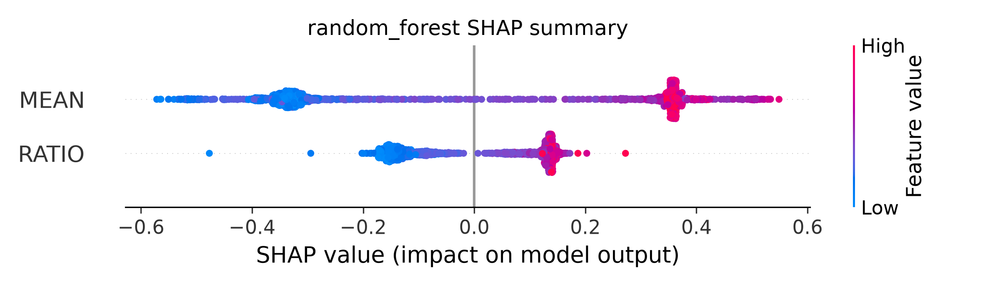

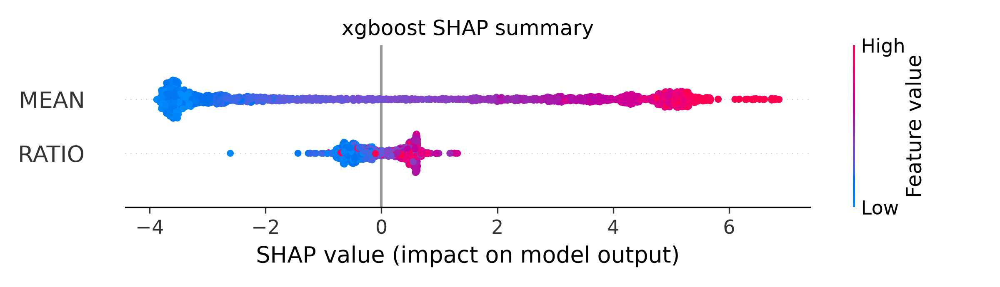

**Figures 6.1-6.2.** Per-sample SHAP values for `MEAN` and `RATIO`, both
models. Unlike the impurity-based importance in Figures 5.5-5.6, SHAP
additionally shows *direction*: which feature values push a prediction
toward "attack" versus "non-attack," and by how much for each individual
sample, not just an aggregate weight. Worth writing a paragraph
comparing what these two figures say against Figures 5.5/5.6, do the
two importance methods agree on which feature dominates, or not, and
what would it mean for this dissertation's claims if they disagreed?

**LSTM and autoencoder: timestep-level evidence.**

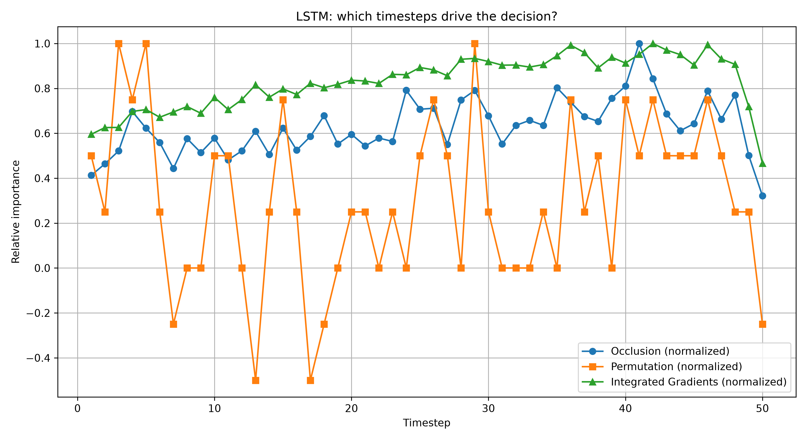

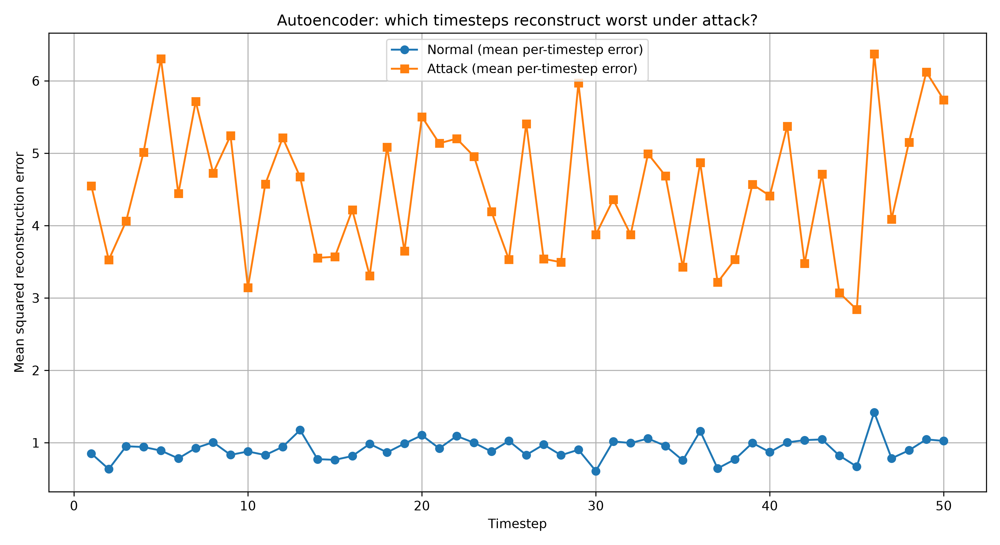

**Figures 6.3-6.4.** Three independent LSTM interpretability methods
(occlusion, permutation, Integrated Gradients, Figure 6.3) and the
autoencoder's per-timestep reconstruction error (Figure 6.4, an entirely
different model, different mechanism) all separately point to timesteps
36-46 as most important (§ 5.10). Worth stating why this convergence is
meaningful: these are four different methods on two architecturally
unrelated models, this isn't one method's artefact, and the two figures
above are the direct visual evidence for that claim, worth describing
what specifically overlaps between them (do the peaks in Figure 6.3 line
up with the peak in Figure 6.4 within a timestep or two, or only
approximately?) rather than only citing the summary numbers in § 5.10.

- Open question worth naming, not necessarily answering: is there a
  physical reason timesteps 36-46 specifically matter, e.g. does the
  Rayleigh fading process or the accumulation of `RATIO`'s excess-power
  statistic make later timesteps disproportionately informative? This
  connects back to the `MEAN`-alone result in § 6.2, if information
  accumulates roughly uniformly over the window, why would specific late
  timesteps dominate the LSTM's attention? Worth exploring or at least
  flagging as future work if not resolved here.

## 6.7 Evasion Robustness: What This Result Does and Doesn't Show

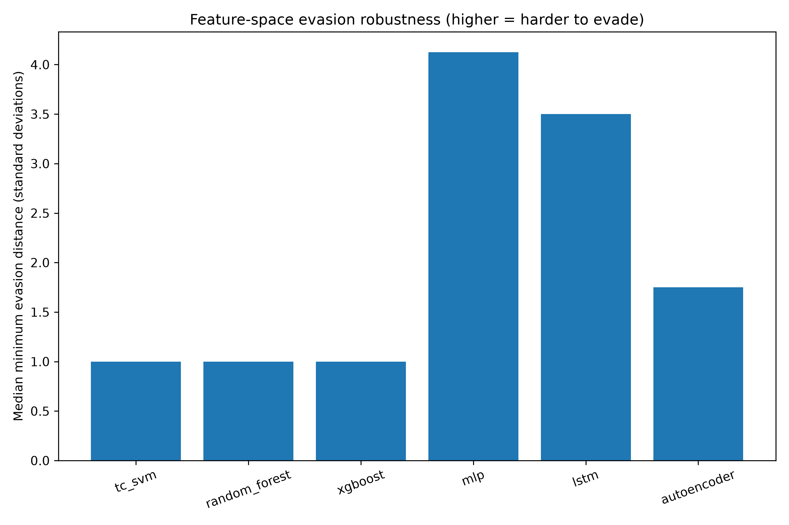

**Figure 6.5.** Distribution underlying Table 5.13: for each model, the
smallest feature-space perturbation (in SD) that flipped a correctly-
detected attack sample's prediction. The two-cluster pattern (classical
models bunched near 1 SD, deep learning models spread from 1.75-4+ SD) is
visible directly here, worth describing whether the two clusters overlap
at all, since a claim of "clean separation" is stronger than "mostly
separated, with some overlap," and the two limitations below determine
how much weight that separation, however clean, can actually bear.

- Table 5.13 shows classical models are evaded within a median 1
  standard deviation of feature perturbation, versus 1.75-4.1 SD for the
  deep learning models, a large apparent robustness gap.
- Two limitations that should qualify this claim heavily, both already
  flagged in the methodology (§ 3.4) and worth repeating here with
  teeth: (1) this is feature-space robustness, not a claim that an
  attacker could physically achieve this perturbation on the channel,
  translating a "distance in `MEAN`/`RATIO`-space" or "distance in
  `E1`-`E50` space" into an actual achievable `rho_E`/fading realisation
  was out of scope. (2) the classical and deep learning models are
  perturbed in different-dimensional spaces (2 features vs. 50), and
  distance in standard deviations is not obviously comparable across
  dimensionality, part of the apparent robustness gap could be a
  dimensionality artefact rather than a genuine robustness difference.
  State this as an open confound, not a resolved finding.

## 6.8 Comparison Against Hoang et al. (2021)

Full detail in `docs/literature_comparison.md` § 1; pull the direct
numeric comparison table into this section. Key points:

- The SNR-sensitivity replication (their Fig. 10 vs. this work's Table
  5.8) lands within 1-2 percentage points at both ends of the curve
  despite two independent implementations four years apart, worth
  stating as genuine validation of the recovered system model (§ 3.1),
  not just a structural resemblance.
- The baseline accuracy gap (94.25% here vs. their reported 91.28%) is
  plausibly explained by a richer training distribution (this work
  trains across all window lengths `T0`-`T` at once) and a documented
  hyperparameter search versus their fixed `gamma`, state this as a
  plausible explanation, not a demonstrated one, since the two setups
  aren't a controlled comparison.

## 6.9 Overall Limitations of This Work

Consolidate from the points above into a short, direct list, this is
where the "critical" in critical review earns its name:

- Cross-family significance rests on the weakest available test (§ 6.1).
- The representation ablation complicates rather than confirms the
  dissertation's own framing of its central contribution (§ 6.2).
- Evasion robustness has an unresolved dimensionality confound (§ 6.7).
- The MLP's low-SNR failure is only partially fixed (§ 6.5).
- Everything in this dissertation is evaluated on simulated data from
  one specific system model (`K=4, L=10`, Rayleigh fading); no claim is
  made, or should be made, about real hardware or a different system
  configuration without further validation.

---

# 7. Critical Review of the Project Objectives

*Status: scaffold, and more so than any other chapter, this one should be*
*written in your own first-person voice: it's a personal assessment of*
*your own work against your own stated goals, not a technical summary.*
*What's below for each objective is the factual basis (what was actually*
*done, traceable to Chapters 4-6), not a drafted verdict; write the*
*"met / partially met / not met" judgement and the reflection around it*
*yourself. Both samples this format is drawn from are candid here,*
*Sample 8 plainly states an evaluation method was never completed rather*
*than implying otherwise, that kind of honesty reads as strength, not*
*weakness, in this chapter specifically.*

Recall the six objectives from § 1.3.

## 7.1 Objective 1: Reproduce and Validate the Classical Baseline

What was done: TC-SVM, Random Forest, and XGBoost implemented on the
`MEAN`/`RATIO` features from Hoang et al.'s framework (§ 3.1-3.3); the
SNR-sensitivity sweep independently reproduces their Fig. 10 within 1-2
points at both ends (§ 6.8); baseline accuracy is within ~3 points of
their reported figure, with a stated, plausible (not proven) explanation
for the gap.

What wasn't done: only the RBF kernel was used; Hoang et al. compare four
kernels (linear, RBF, polynomial, sigmoid), and their own finding about
`gamma`-driven overfitting (§ 2.2) was never checked against this work's
classical models specifically, only observed analogously in the MLP.

*Your assessment: met / partially met / not met, and why.*

## 7.2 Objective 2: Sequence-Consuming Deep Learning vs. Classical Baseline

What was done: MLP, LSTM, and Autoencoder implemented on the raw
50-step sequence and compared against the classical baseline on
accuracy, F1, AUC, with cross-validation and significance testing.

What's complicated, not simply achieved: § 6.1 is direct about this, the
significance evidence for "sequence models beat classical models" rests
on the weakest test used in this dissertation (unpaired Mann-Whitney,
different underlying datasets), and § 6.2's ablation shows the advantage
isn't really about "raw sequence vs. hand-engineered features" so much as
"the full sequence eventually recovers what a well-chosen 2-feature
summary already captured." Worth deciding, in your own words, whether
that nuance means this objective was fully met, or only partially,
depending on how strictly "compare their detection performance" is read.

*Your assessment.*

## 7.3 Objective 3: Statistically Rigorous Evaluation Protocol

What was done: stratified 5-fold CV with documented hyperparameter
search for all six models; Wilcoxon signed-rank and McNemar within model
families; Mann-Whitney across families, correctly labelled as weaker
evidence rather than presented as equivalent; calibration curves,
PR-AUC, latency, and model size for every model.

What wasn't done: a paired cross-family test (would require evaluating
classical models on the sequence dataset or vice versa, § 6.1, named as
a limitation rather than attempted).

*Your assessment, this one is closest to straightforwardly met.*

## 7.4 Objective 4: Robustness Under Realistic Deployment Conditions

What was done: class imbalance down to 99.9:0.1 (§ 5.5), a `rho_E` SNR
sweep across two orders of magnitude (§ 5.7), and black-box feature-space
evasion search (§ 5.11).

What's limited: the evasion result has two named, unresolved caveats
(feature-space only, not physically grounded; a dimensionality confound
between the 2-feature and 50-feature models, § 6.7), the class-imbalance
result correctly stops reporting at the point where too few positive
samples remain rather than extrapolating past it.

*Your assessment.*

## 7.5 Objective 5: Ablation and Interpretability

What was done: the representation/sequence-length ablation directly
answers "architecture vs. information" (§ 6.2, LSTM has a small but
consistent edge at every fixed sequence length, but most of the total
performance comes from information, not architecture); SHAP, LSTM
occlusion/permutation/Integrated Gradients, and autoencoder
reconstruction error all implemented, with a genuinely convergent finding
(timesteps 36-46, four independent methods, two unrelated models, § 6.6).

What's open: § 6.6 names a physical question (why that specific window)
that this dissertation raises but does not resolve. Worth deciding
whether "investigate... and identify which parts of the input sequence
drive their decisions" is met by identifying the window without
explaining the underlying physical cause.

*Your assessment.*

## 7.6 Objective 6: Deployment Trade-offs

What was done: latency, model size, and parameter count for all six
models (§ 5.4/6.4); the single-class (autoencoder) vs. supervised
trade-off discussed directly and tied to Hoang et al.'s SC-SVM (§ 6.3).

*Your assessment, this one is also close to straightforwardly met.*

## 7.7 Overall

*Write a short closing paragraph here: on balance, how much of the stated*
*aim (§ 1.3) was achieved? Where the honest answer is "partially," say so*
*and say why, per-objective detail above gives you the material, this*
*paragraph is where you weigh it. This is also a natural place to note*
*anything you'd have scoped differently with hindsight, that's exactly*
*the kind of reflection both samples include here and nowhere else in*
*the document.*

---

# 8. Conclusion

*Status: scaffold. Both samples keep this short (3-4 pages), a summary*
*and a future-work list, not new analysis. Draft it last, once Chapters*
*6-7 are finalised, so it accurately reflects what you actually concluded*
*there rather than what was planned at the outset.*

## 8.1 Summary

One or two paragraphs, points to hit:

- What the dissertation set out to do (§ 1.3's aim, one sentence).
- What was built: a validated reproduction of Hoang et al.'s classical
  baseline, and three sequence-consuming deep learning detectors compared
  against it under a statistically rigorous, multi-phase evaluation
  protocol (CV and significance testing, class-imbalance and SNR
  robustness, evasion testing, interpretability).
- The headline result, stated with the qualification § 6.1/7.2 earned:
  the LSTM achieves the best cross-validated accuracy (99.13%), but the
  strongest form of evidence for "sequence models beat classical models"
  is the weakest statistical test used in this dissertation, and the
  representation ablation shows the advantage is mostly about the full
  sequence recovering what a two-feature summary already captured, not
  architecture alone.
- One sentence on the autoencoder as a genuinely distinct practical
  option (single-class, smallest model, near-best PR-AUC), not simply a
  weaker classifier.

## 8.2 Key Findings, Restated Briefly

Bullet list, one line each, cross-referencing the chapter/section they
came from, e.g.:

- Statistically indistinguishable classical models (§ 6.1).
- `MEAN` alone nearly matches the full 50-step sequence (§ 6.2).
- Convergent interpretability evidence for timesteps 36-46 across four
  methods and two model types (§ 6.6).
- MLP overfits severely at low eavesdropper SNR; regularisation narrows
  but does not close the gap (§ 6.5).
- Deep learning models resist black-box feature-space evasion
  considerably better than classical models, with a named,
  unresolved dimensionality confound (§ 6.7).
- SNR-sensitivity curve independently replicates Hoang et al. (2021)
  within 1-2 points (§ 6.8).

## 8.3 Limitations

Short version of § 6.9, two or three sentences, this chapter isn't the
place to re-argue them in detail, just to acknowledge they stand.

## 8.4 Real-World Applications and Deployment Scenarios

*This section is drafted in full: it's domain reasoning about where this*
*kind of detector would plausibly be used, grounded in the deployment-cost*
*results already established in Chapter 5/6, not a personal reflection.*
*Trim or reweight it toward whatever application your supervisor or*
*programme finds most relevant.*

The detectors evaluated in this dissertation are trained on a simulated
`K=4, L=10` massive MIMO uplink, so any deployment claim here is
necessarily about *transferability of the approach*, not a demonstrated
result on the named system, that caveat from § 6.9 applies throughout
this section.

**5G/6G massive MIMO base stations.** The setting this dissertation
directly simulates. Pilot contamination is a known, actively-studied
vulnerability in massive MIMO specifically because pilot sequences are
reused across cells for scalability (§ 2.1). A detector integrated into
the base station's channel-estimation pipeline would need to run within
the coherence time of the channel, on the order of milliseconds; Table
5.5's latency figures (sub-millisecond for every model except TC-SVM)
suggest the MLP, LSTM, and autoencoder are compatible with this
constraint in principle, while TC-SVM's 0.377 ms/sample and comparatively
large model size make it the weakest of the six on this specific
criterion, consistent with § 6.4's finding.

**Private 5G and industrial IoT.** Factory, warehouse, and critical
infrastructure deployments increasingly use private 5G/massive-MIMO
cells with a small, known set of legitimate devices, closer to this
dissertation's `K=4` user setting than a public macro-cell with hundreds
of users. Pan et al. [5] (§ 2.3) validate ML-based physical-layer
detection on exactly this kind of industrial CSI data with field
hardware, precedent this dissertation's approach could plausibly follow
toward hardware validation, named as future work below.

**Contexts without labelled attack data.** Any deployment where an
operator cannot assume representative examples of the specific attack
they're defending against, a genuinely common constraint, since
adversaries adapt and historical attack examples may not represent a
novel one, is exactly the scenario the autoencoder (§ 6.3) is suited to:
trained entirely on normal traffic, no labelled attack examples required.
Worth naming explicitly as the practical argument for including a
single-class model at all, beyond matching Hoang et al.'s SC-SVM.

**Resource-constrained edge deployment.** Small-cell and edge base
stations, or any deployment with tight power/memory budgets, would
weight model size and latency (§ 6.4) more heavily than the headline
accuracy comparison in § 6.1. On that criterion, the autoencoder (23 KB)
and MLP (71 KB) are far more deployable than Random Forest (25 MB) or
TC-SVM (840 KB, growing with training-set size via its support vector
count), independent of their relative accuracy.

**Beyond cellular: UAV swarms, V2X, and satellite uplinks.** Any wireless
system relying on pilot-based or reference-signal-based channel
estimation among a known set of legitimate transmitters, drone swarm
coordination links, vehicle-to-everything (V2X) safety channels, or
satellite uplinks with a fixed set of ground stations, faces a
structurally similar attack surface. Applying this dissertation's
approach there would require re-deriving the system model (§ 3.1) for
the relevant channel statistics (e.g. line-of-sight-dominated Rician
fading for satellite links, rather than the Rayleigh fading assumed
here), not simply reusing the trained models as-is.

## 8.5 Future Work

Concrete, specific items, not a generic list, drawn directly from gaps
named in Chapters 2, 6, and 7:

- A paired cross-family significance test (evaluate classical models on
  the sequence dataset, or vice versa), to put § 6.1's central claim on
  firmer statistical ground.
- Ground the evasion-robustness perturbation in the physical simulator,
  translating a feature-space distance into an actually achievable
  `rho_E`/fading realisation, and resolve the dimensionality confound
  between the 2-feature and 50-feature evasion results (§ 6.7).
- Investigate the physical cause of the LSTM/autoencoder's convergent
  attention on timesteps 36-46 (§ 6.6), is this a property of the
  Rayleigh fading process, the `RATIO` statistic's accumulation
  behaviour, or something else.
- Extend the classical baseline to Hoang et al.'s full four-kernel SVM
  comparison and their `gamma`-overfitting study (§ 7.1).
- A deeper literature review pass to close the gap named in § 2.4
  (broader ML-for-wireless-security work beyond the five physical-layer
  security papers used here).
- Validation beyond the simulated `K=4, L=10` Rayleigh-fading model used
  throughout, real or hardware-in-the-loop data (e.g. USRP-based, following
  Pan et al.'s validation approach [5]), or a broader sweep of `K`/`L`,
  was out of scope here and would be the natural next step toward a
  deployable system.
- Extend the system model itself (§ 3.1) to fading distributions relevant
  to the non-cellular applications named in § 8.4, Rician fading for
  satellite/line-of-sight links in particular, to test whether the
  representation-ablation finding (§ 6.2, a two-statistic summary
  capturing most of a sequence model's advantage) still holds outside the
  Rayleigh-fading setting it was established in.
- A resource-constrained deployment study directly comparing the
  autoencoder and MLP (the two smallest, lowest-latency models, § 6.4) on
  actual edge hardware, rather than the model-size/latency proxies used
  here, to validate § 8.4's edge-deployment argument with real
  measurements.

---

# References

IEEE numbered style, matching the in-text citations `[1]`-`[5]` used
throughout Chapters 2, 3, and 6. Extend this list (renumbering
consistently everywhere) if the literature review gap noted in § 2.4 is
filled in with further sources.

[1] T. M. Hoang, T. Q. Duong, H. D. Tuan, S. Lambotharan, and L. Hanzo,
"Physical Layer Security: Detection of Active Eavesdropping Attacks by
Support Vector Machines," *IEEE Access*, vol. 9, 2021.

[2] [Xie et al.], "Physical Layer Authentication With High Compatibility
Using an Encoding Approach," *IEEE Transactions on Communications*, 2022.

[3] [Ma et al.], "Physical-Layer Authentication Enhancement via Random
Watermark Hopping," *IEEE Internet of Things Journal*, 2024.

[4] [Lu et al.], "Robust Channel-Phase-Based Physical-Layer Authentication
for Multicarriers Transmission," *IEEE Internet of Things Journal*, 2025.

[5] [Pan et al.], "Threshold-Free Physical Layer Authentication Based on
Machine Learning for Industrial Wireless CPS," *IEEE Transactions on
Industrial Informatics*, 2019.

*Entries [2]-[5] have first-author surnames only, from the working notes*
*in `docs/literature_comparison.md`; fill in full author lists, exact*
*volume/issue/page numbers before submission, pull them from the original*
*PDFs/DOIs you were given rather than retyping from memory, citation*
*accuracy is checked and matters.*

---

